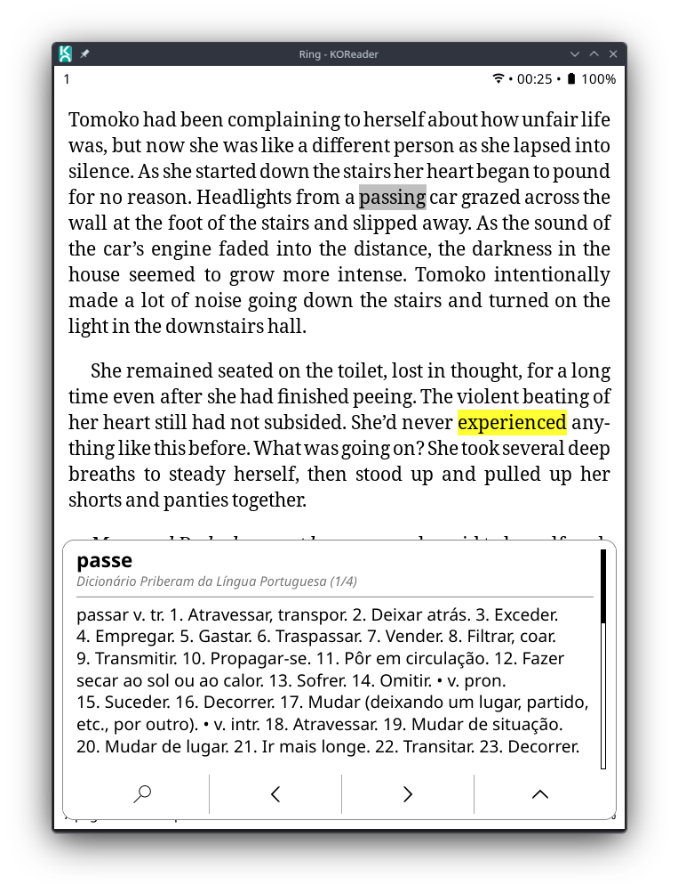
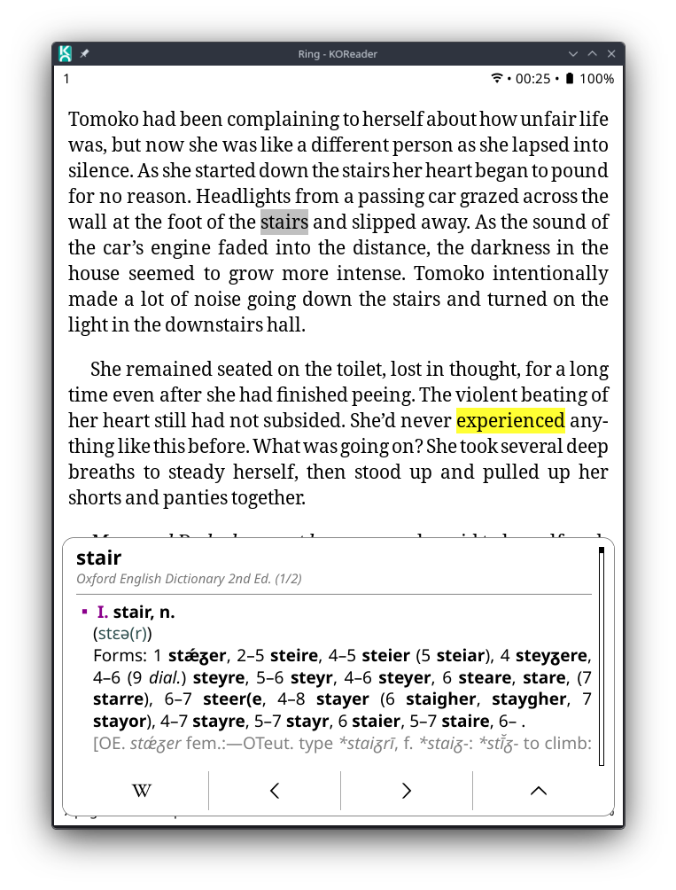
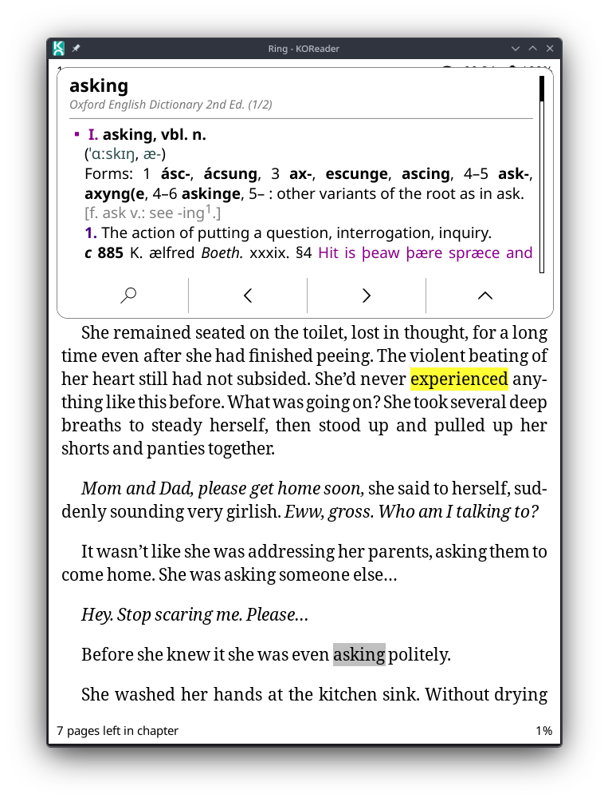
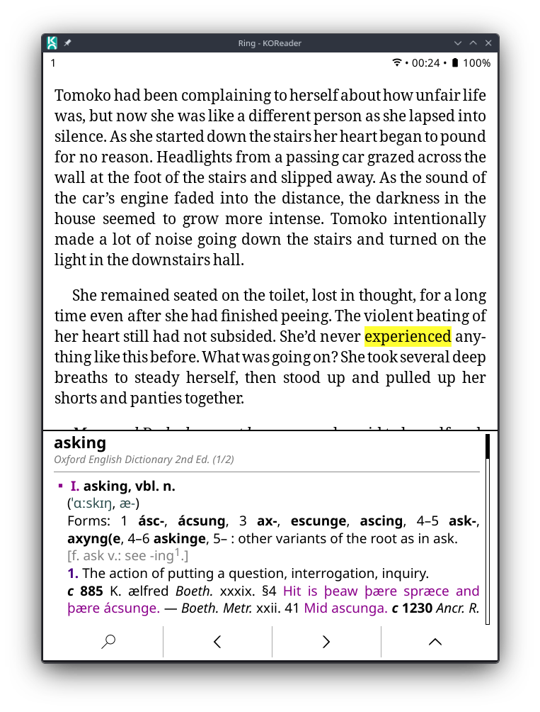
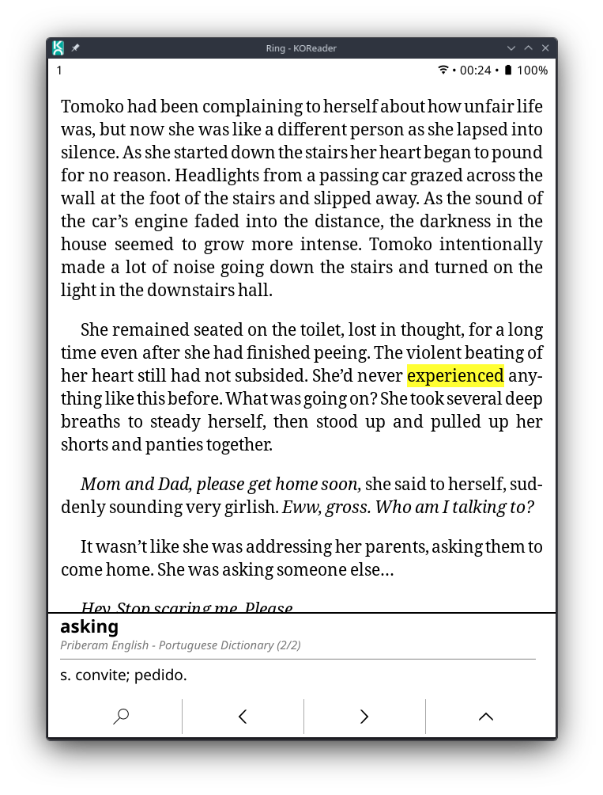
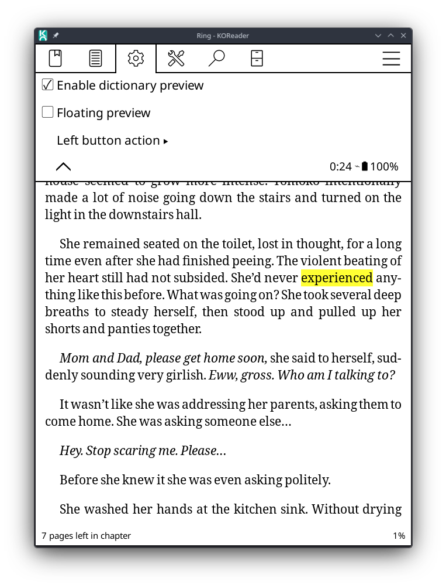
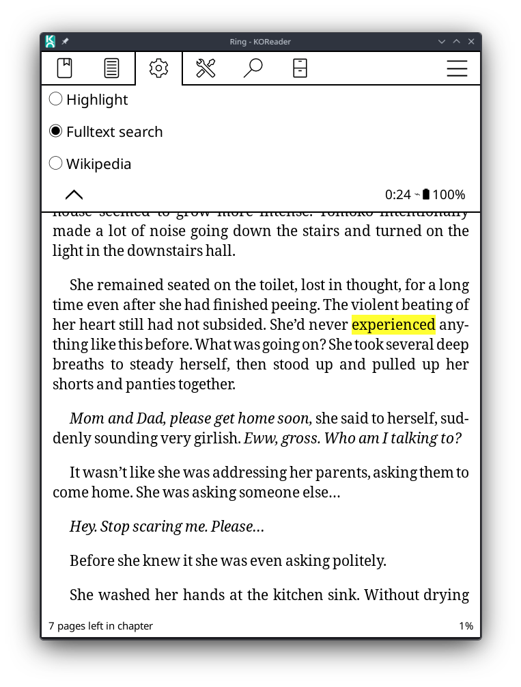

# KOReader Dictionary Preview 

**Dictionary Preview** is a KOReader reader plugin that changes the dictionary lookup flow. Instead of immediately opening KOReader's full dictionary popup, it first shows a compact preview with the dictionary result. The preview can be displayed either as a bottom panel or as an optional floating card that automatically avoids covering the selected word.

From the preview you can open the original dictionary popup, switch between dictionary results, search the selected term, highlight the selection, or look it up on Wikipedia.

The plugin metadata registers it as `dictionarypreview` with the display name **Dictionary Preview**. Its purpose is to show a compact dictionary preview before opening the full dictionary popup.

## Features

- Shows dictionary results in a compact preview before opening KOReader's full dictionary popup.
- Supports two preview layouts:
  - **Bottom panel**, displayed at the bottom of the screen;
  - **Floating preview**, displayed as a compact floating card.
- Floating preview automatically chooses whether to appear near the top or bottom of the screen to avoid covering the selected word.
- Preserves dictionary HTML formatting when the dictionary result provides its own CSS.
- Falls back to safe HTML normalization for dictionaries without CSS, avoiding oversized headings and broken spacing.
- Uses adaptive preview height, so short definitions do not reserve a large blank area.
- Adds a minimum compact height to avoid unnecessary scrolling in short one-sentence definitions.
- Shows a structured preview header:
  - selected word in prominent bold text;
  - dictionary name below it in smaller italic text;
  - dictionary result count when multiple results are available.
- Supports multiple dictionary results:
  - swipe left to go to the next dictionary result;
  - swipe right to go to the previous dictionary result;
  - navigation buttons are hidden when there is only one useful result or no dictionary match.
- Opens the original KOReader dictionary popup through the details button.
- Prevents nested preview panels while the original dictionary popup is open.
- Provides a configurable left button action:
  - **Highlight** the current selection;
  - **Fulltext search** in the current book;
  - **Wikipedia** lookup.
- Supports optional custom plugin icons for Highlight and Wikipedia.
- Includes small performance improvements such as cached icon lookup and reduced repeated layout calculations.
- Adds a version entry in the plugin settings menu.

## Installation

Copy the plugin folder to KOReader's `plugins` directory:

```text
dictionarypreview.koplugin/
├── _meta.lua
├── main.lua
└── icons/                  # optional
    ├── highlight.svg       # optional
    └── wikipedia.svg       # optional
```

The final path should look like this:

```text
koreader/plugins/dictionarypreview.koplugin/
```

Then restart KOReader.

## Enabling the plugin

After restarting KOReader, open a book and go to the reader menu. The plugin adds a **Dictionary preview** settings entry.

The menu contains:

- **Enable dictionary preview**: turns the preview behavior on or off.
- **Floating preview**: switches from the default bottom panel to the floating card layout.
- **Left button action**: chooses what the left button in the preview does.
- **Version: vX.Y.Z**: displays the current plugin version.

By default, the preview is enabled, the bottom panel layout is used, and the left button performs a full-text search in the book.

## How it works

When a word or selection triggers KOReader's dictionary lookup, the plugin intercepts the dictionary result before KOReader opens the normal dictionary popup. If the preview is enabled, it closes the temporary lookup UI and shows a compact preview with the first useful dictionary result.

In the default layout, the preview is shown as a bottom panel. When **Floating preview** is enabled, the preview is shown as a floating card. The card uses the selected word position to decide where it should appear:

- if there is enough room below the selected word, the card appears near the bottom;
- if the selected word is low on the screen, the card appears near the top;
- if neither side has ideal space, the plugin chooses the side with more available room.

This keeps the preview from overlapping the selected word whenever possible.

If the lookup returns multiple real dictionary results, the preview allows navigation between them. Results that only represent “no definition found” placeholders are ignored for navigation. When no dictionary contains a definition, the plugin still opens a preview with a “No definition found” message, so the configured left action and original popup button remain available.

The original KOReader dictionary popup can still be opened from the preview. Once that native popup is open, the plugin temporarily disables new preview panels to avoid visual conflicts when selecting text inside the original dictionary popup.

## Controls

### Buttons

The preview can show these buttons:

| Button | Action |
|---|---|
| Left button | Configurable: Highlight, Fulltext search, or Wikipedia |
| Previous | Previous dictionary result; shown only when useful |
| Next | Next dictionary result; shown only when useful |
| Details | Opens the original KOReader dictionary popup |

The left button uses KOReader's native search icon for full-text search. For Highlight and Wikipedia, the plugin can use custom icons from the plugin's own `icons/` folder. If no custom icon is found, it falls back to translated text labels from KOReader.

### Gestures

| Gesture | Action |
|---|---|
| Swipe left | Next dictionary result |
| Swipe right | Previous dictionary result |
| Swipe down | Close preview when using the bottom panel or a floating card anchored near the bottom |
| Swipe up | Close preview when using a floating card anchored near the top |
| Tap outside the preview | Close preview |

## Custom icons

The plugin can load custom icons from:

```text
dictionarypreview.koplugin/icons/
```

Supported extensions:

```text
.svg
.png
```

Supported file names:

```text
icons/highlight.svg
icons/highlight.png
icons/dictionarypreview.highlight.svg
icons/dictionarypreview.highlight.png

icons/wikipedia.svg
icons/wikipedia.png
icons/dictionarypreview.wikipedia.svg
icons/dictionarypreview.wikipedia.png
```

If the selected action is **Highlight** or **Wikipedia** and no matching icon exists, the plugin displays a text fallback:

- `Highlight`
- `Wikipedia`

These labels are wrapped with KOReader's `gettext`, so they can be translated by KOReader when available.

## Configuration

The plugin stores settings through KOReader's reader settings system.

| Setting key | Purpose |
|---|---|
| `dictionarypreview_enabled` | Enables or disables the preview |
| `dictionarypreview_floating_preview` | Enables or disables floating preview mode |
| `dictionarypreview_left_action` | Stores the selected left button action |

Available left button action IDs:

```text
highlight
search_book
wikipedia
```

## Dictionary formatting

The plugin prefers the dictionary's own formatting when available. If a dictionary result contains CSS, the preview passes that CSS to `ScrollHtmlWidget`, along with the dictionary resource directory. This helps preserve fonts, spacing, lists, examples, and other dictionary-specific styling.

For dictionaries that do not provide CSS, the plugin applies a fallback normalization pass. This is mainly useful for dictionaries that use tags like `<h1>` or `<h2>` for long grammatical forms, which can otherwise appear too large in a compact preview.

## Performance notes

The plugin keeps the preview lightweight by avoiding unnecessary recalculations and by reusing small cached values where safe, such as icon lookup results, static layout values, and repeated HTML class style mappings.

Screen dimensions are still evaluated when the preview is created, so the layout can react correctly to orientation or screen-size changes.

## Notes and limitations

- This plugin is intended for the reader view only.
- It monkey-patches the reader dictionary lookup method at runtime, so future KOReader changes to dictionary internals may require adjustments.
- Highlight and Wikipedia actions depend on KOReader's current selection/highlight state. The plugin stores a snapshot of the active selection before dismissing the lookup UI so these actions can still work from the preview.
- Floating preview positioning depends on the selection boxes reported by KOReader. If that position is unavailable, the floating card falls back to the bottom position.
- The custom icon loader only checks the plugin's local `icons/` directory for Highlight and Wikipedia icons.
- The preview height is adaptive, but complex dictionary HTML can still produce slightly different spacing depending on the renderer and dictionary CSS.

## Uninstalling

Remove the folder:

```text
koreader/plugins/dictionarypreview.koplugin/
```

Then restart KOReader.

Settings saved in KOReader may remain until manually removed from KOReader's settings storage, but they will not have any effect once the plugin is removed.

## Screenshots








