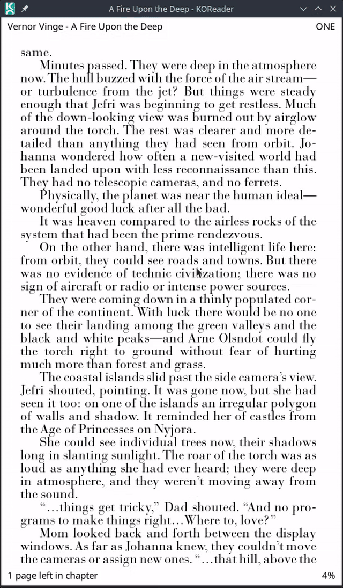
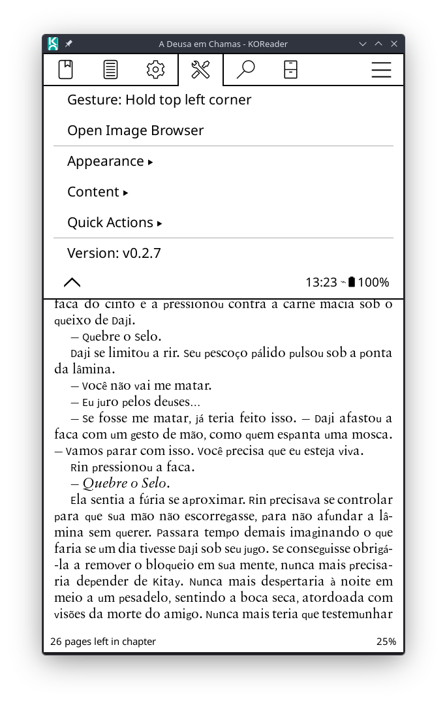

# Image Browser 

**Image Browser** is a KOReader reader plugin for EPUB books. It lets you peek at maps, family trees, diagrams and other reference images from anywhere in the book, without losing your reading position, and browse them in a rounded left-side drawer or a centered popup.

> **Origin:** Image Browser is based on the [Glimpse plugin](https://github.com/Fank1/glimpse/tree/main). The scanner, gallery, viewer chrome, and configuration menu in this repository are a substantially reworked version, but the original idea and starting point come from Glimpse.

The plugin metadata registers it as `imagebrowser` with the display name **Image Browser**.

## Features

- Finds every reference image in an EPUB by parsing the book's own HTML and OPF files directly (via `imagebrowser_scanner.lua`), which gives real pixel dimensions plus captions and alt text for filtering.
- Two viewing scopes:
  - **Show images up to current chapter**: hides images beyond your current position, so browsing never spoils what's ahead.
  - **Show all images**: shows every reference image in the book, including parts you haven't reached yet.
- Optional relevance filter ("Ignore irrelevant images", on by default) sets aside covers, publisher logos and ornaments while keeping maps, family trees, diagrams and illustrations. Anything filtered can be reviewed and restored from the Gallery's Ignored tab, and anything kept by mistake can be sent there from the viewer.
- Gallery grid view of all matching images for the current book, with separate Shown/Ignored tabs.
- Pinch-to-zoom and pan on the full-resolution image, with double-tap to toggle between fit-to-screen and maximum zoom centered on the tapped point.
- Per-image 90° rotation, remembered per book.
- "Show in Book" jumps straight to the image's location in the reader.
- Three popup layouts: left-side panel (rounded), centered popup (rounded), and centered popup (square corners).
- Optional ‹ › navigation buttons as an alternative to swiping.
- Optional image captions overlay (beta), read from the book's own `figcaption`/title/alt text.
- Optional inversion of images while KOReader's night mode is on.
- Configurable "Quick Actions" menu (the viewer's ⋯ popup): choose which of Gallery, Ignore Image, Mode switch, Rotate, Show in Book, Restore ignored images, Nav Buttons toggle, Captions toggle, and Night Mode Invert toggle appear.
- Caches its scan of each book, so reopening Image Browser does not re-parse the EPUB every time; a manual "Rescan this book" option is available if the file changed.
- Caches decoded/scaled bitmaps, gallery thumbnails, chrome icons, and the panel's drop shadow, so navigating between images and reopening the panel stays fast on e-ink hardware.
- Optional drop shadow can be disabled if it leaves e-ink ghosting behind the panel.
- One-time onboarding tip nudges you to bind the "Open Image Browser" gesture the first time you open it without one set.

## Installation

Copy the plugin folder to KOReader's `plugins` directory:

```text
imagebrowser.koplugin/
├── _meta.lua
├── main.lua
├── imagebrowser_scanner.lua
└── assets/
    ├── back.svg
    ├── close.svg
    ├── gallery.svg
    ├── goto.svg
    ├── hide.svg
    ├── mode.svg
    ├── navigate.svg
    ├── next.svg
    ├── prev.svg
    ├── reset-rotation.svg
    ├── restore.svg
    ├── rotate.svg
    └── zoom.svg
```

The final path should look like this:

```text
koreader/plugins/imagebrowser.koplugin/
```

Then restart KOReader.

## Enabling the plugin

Image Browser works only with EPUB books (crengine). After restarting KOReader, open an EPUB and go to the reader menu (Tools). The plugin adds an **Image Browser** settings entry — no separate enable/disable toggle is needed; opening a non-EPUB document shows an explanatory message instead of the viewer.

For one-touch access, assign the gesture action **Open Image Browser** under **Settings → Taps and gestures → Gesture manager → (pick a gesture) → Reader**. The plugin menu's first row always shows which gesture (if any) currently triggers it.

## How it works

When Image Browser scans a book, it parses the EPUB's raw HTML and OPF directly rather than relying on the rendered document, which gives it real pixel dimensions, `figcaption`/title/alt text, and enough context (repetition across files, classes, filenames, size) to tell reference figures apart from covers, publisher logos and ornaments.

- The scan result is cached per book. It is invalidated automatically when the plugin's scanner format changes (an upgrade) and can be forced with **Content → Rescan this book**, useful if the book file was replaced.
- The **relevance filter** (on by default) uses this data to set images aside as "Ignored" without deleting anything; both directions are correctable — bring a wrongly set-aside image back from the Gallery's Ignored tab, or send a wrongly kept one there with **Ignore Image** in the viewer's ⋯ menu.
- The **scope** setting controls how far ahead the image list reaches: "up to current chapter" keeps anything beyond your current chapter hidden, at chapter granularity.
- Ignored images and per-image rotation are remembered per book (KOReader's `doc_settings`), independent of the plugin's global settings.

## Controls

- **Swipe left/right** (at fit-to-screen scale): go to the next/previous image.
- **Double-tap**: toggle between fit-to-screen and maximum zoom, centered on the tapped point.
- **Pinch / pan** while zoomed: standard KOReader image-viewer zoom and pan.
- **Tap outside the panel** (centered popup layouts): close Image Browser.
- **Tap the ⋯ button**: open the Quick Actions menu.
- **Tap the dot indicator**: jump near that position in the image list.
- **Tap the top edge of the screen**: opens KOReader's own top menu over Image Browser (can be disabled in Appearance settings).
- **Physical page-turn keys**: same as swiping; flip grid pages while the Gallery is open.
- **In the Gallery**: tap a thumbnail to open it; long-press a thumbnail to ignore it, or to add it back if it's already in the Ignored tab; tap the Shown/Ignored pill to switch tabs.
- Optional **‹ ›** on-screen navigation buttons, as an alternative to swiping (off by default; grayed out when there is no image on that side).

## Configuration

The **Image Browser** menu (reader Tools menu) follows the same grouped layout as the other plugins in this repository:

- `Gesture: …`: shows which gesture currently opens Image Browser, and tapping it explains how to assign one.
- `Open Image Browser`: opens the viewer directly from the menu. Disabled when no document is open.
- `Appearance`: chooses the popup position and corner style, night-mode inversion, navigation buttons, captions, the top tap zone, and the panel shadow.
  - `Popup appearance`: left-side rounded panel, centered rounded popup, or centered square popup.
  - `Invert in Night Mode`: shows images inverted while KOReader's night mode is on.
  - `Show Nav Buttons`: shows the ‹ › on-screen navigation buttons in the viewer.
  - `Show image captions (beta)`: overlays the image's caption in the viewer's top-left corner.
  - `Enable top menu tap zone`: lets a tap on the screen's top strip open KOReader's top menu over the viewer.
  - `Disable shadow`: removes the panel's drop shadow (the main source of e-ink ghosting behind the panel).
- `Content`: chooses which images are found and shown — browsing scope, the relevance filter, and ignored/restored images.
  - `Mode: Show images up to current chapter / Show all images`: the viewing scope described above.
  - `Ignore irrelevant images`: turns the relevance filter on or off.
  - `Rescan this book`: discards the cached scan and re-parses the book's images.
  - `Restore ignored images (n)`: brings back every image ignored in the current book. Only enabled when at least one image is ignored.
- `Quick Actions`: choose which rows appear in the viewer's ⋯ menu.
- `Version: X.Y.Z`: displays the current plugin version and the Glimpse attribution.

## Performance notes

Image Browser is built to stay responsive on e-ink hardware:

- Decoded and scaled bitmaps, gallery thumbnails, and the panel's drop shadow are all cached and reused between openings of the same size, so browsing between images and reopening the panel does not redecode from disk each time.
- The small set of chrome icons (back, close, gallery, rotate, and the rest of `assets/`) is decoded from SVG once and reused, instead of being re-rasterized on every image switch, zoom step, gallery page turn, or rotation.
- Scanning a book for images is cached in a per-book sidecar, so reopening Image Browser does not re-parse the EPUB unless the book changed or a manual rescan is requested.
- The drop shadow — the main cause of e-ink ghosting around the panel — can be turned off entirely from Appearance settings.

## Known limitations

- EPUB only: other formats (PDF, DjVu, CBZ, and so on) are not supported. Opening the viewer on an unsupported document shows an explanatory message instead.
- Image captions are a beta feature; caption quality depends on how the book marks up `figcaption`, `title`, and `alt` text.
- The relevance filter is heuristic. It can occasionally set aside a genuine reference image or keep a decorative one; both are correctable per image, from the viewer's ⋯ menu or the Gallery's Ignored tab.
- No gesture is bound to open Image Browser by default; assign one from the Gesture manager for one-touch access (the plugin nudges this once on first use).

## Uninstalling

Remove the folder:

```text
koreader/plugins/imagebrowser.koplugin/
```

Then restart KOReader.

Settings saved in KOReader may remain until manually removed from KOReader's settings storage, but they will not have any effect once the plugin is removed.

## Screenshots




## Credits

Based on the [Glimpse plugin](https://github.com/Fank1/glimpse/tree/main) for KOReader.
