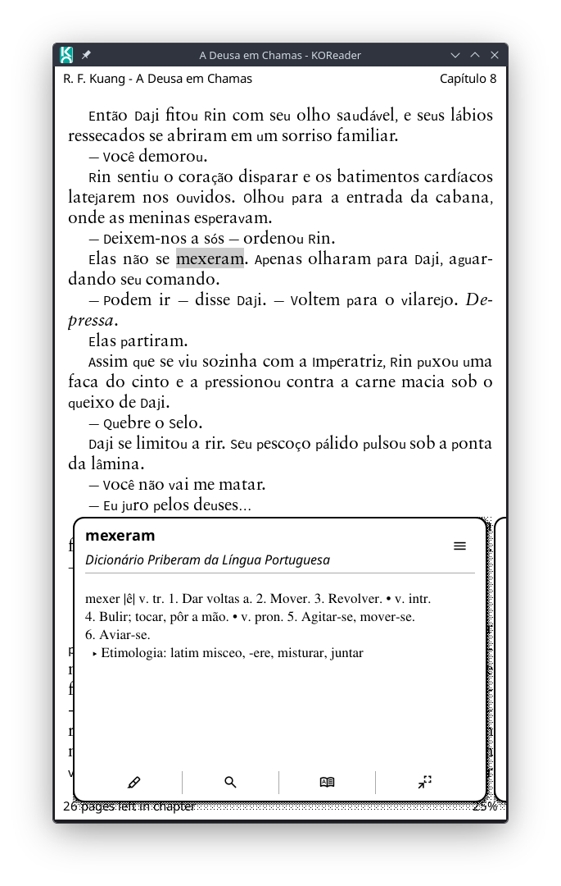
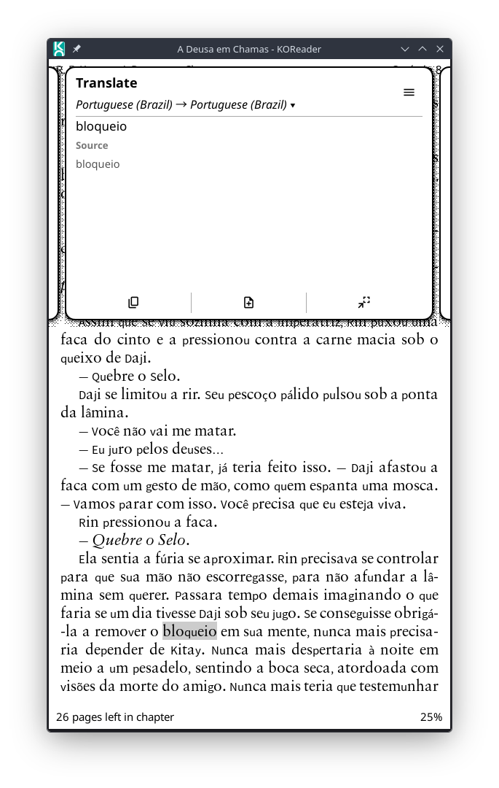
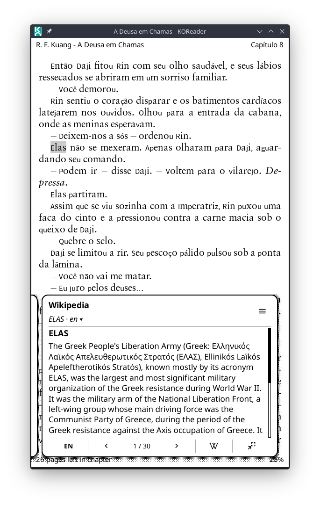
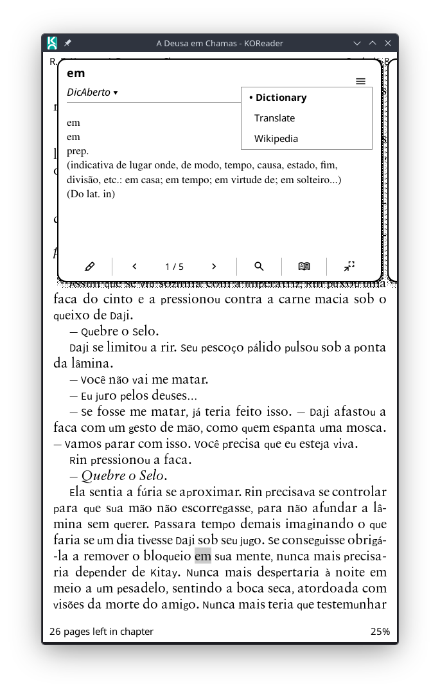
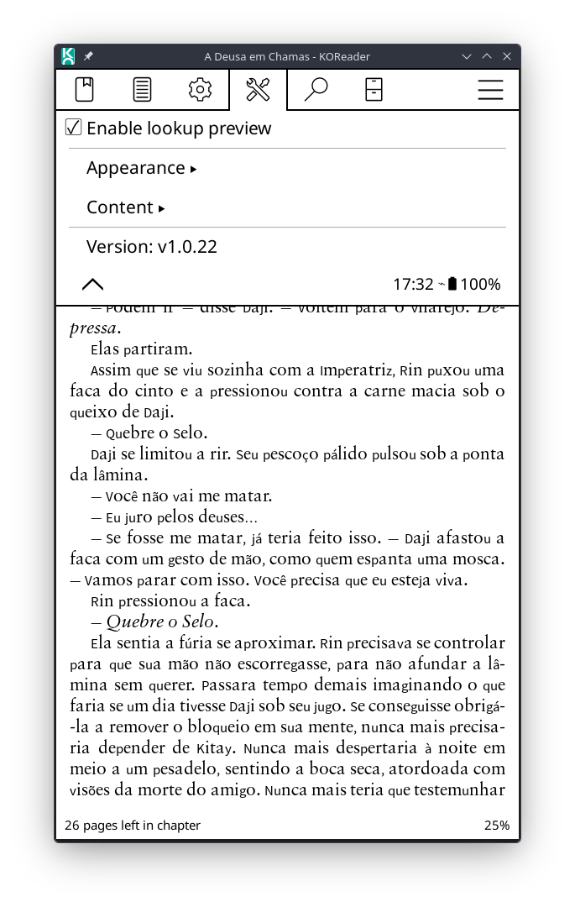

# KOReader Lookup Preview 

**Lookup Preview** is a KOReader reader plugin that changes the lookup flow for selected text. Instead of opening each native lookup window immediately, it first shows a compact floating carousel with preview cards for **Dictionary**, **Translate**, and **Wikipedia**.

The plugin keeps KOReader's original dictionary, translator, and Wikipedia views available from the preview cards, while making common actions such as switching dictionaries, changing the translation target language, selecting the Wikipedia language, copying translations, creating notes, and opening full articles accessible from the carousel itself.

The plugin metadata registers it as `lookuppreview` with the display name **Lookup Preview**. Its purpose is to provide a less intrusive, faster, and more unified lookup experience for selected text in the reader.

## Features

- Shows a floating carousel after selected text is sent to Dictionary, Translate, or Wikipedia.
- Provides three preview cards:
  - **Dictionary**, with definition preview and dictionary navigation;
  - **Translate**, with compact translation preview and target language selection;
  - **Wikipedia**, with article introduction preview and language selection.
- Opens the carousel directly on the card matching the action selected by the user.
- Supports horizontal swipes to move between Dictionary, Translate, and Wikipedia.
- Automatically positions the floating carousel near the top or bottom of the screen to avoid covering the selected text when possible.
- Uses a compact header with title and subtitle for each card.
- Uses `menu.svg` for the card selector button in the header; tapping it opens the same card list used by the previous page indicators.
- Keeps KOReader's original native lookup widgets available through compact action buttons.
- Uses lazy loading for Translate and Wikipedia cards, avoiding unnecessary network requests until those cards are opened.
- Reuses the current popup while switching content, reducing unnecessary carousel rebuilds.
- Supports square and rounded card corners from the plugin settings.
- In tabbed mode, uses a square upper-left junction while Dictionary is active, restoring the rounded card corner and extending the Dictionary tab border to meet it on the other tabs.
- Avoids repeating the Translate and Wikipedia tab labels as card titles in tabbed mode, promoting their useful language and result controls to title styling.
- Uses matching dithered shadows along the right and bottom edges of each card, following the card radius in rounded mode while preserving square shadows in square mode.
- Holding any button, the header's card selector button, a clickable subtitle, or a side tab shows a short note saying what it does. The note appears centred on the card, just above it (or below when there is no room), and stays for five seconds after the finger is lifted; a tap or swipe dismisses it sooner.
- Adds a version entry in the plugin settings menu.

## Dictionary card

- Shows the selected word or text and the current dictionary name.
- Displays the dictionary definition inside a scrollable preview area.
- Supports multiple dictionary results.
- Shows the current dictionary result count in regular text between the Previous and Next footer arrows when more than one result is available, without dividers inside that navigation group. Highlight comes before the navigation group, followed by Search and the buttons that open the full dictionary (see below).
- Makes the subtitle clickable to open the dictionary result list.
- Lists dictionary results as:

```text
found word · dictionary name
```

- Provides compact action buttons:
  - **Highlight**: creates a highlight from the current selection when available;
  - **Previous / result count / Next**: switches between dictionary results when multiple results are available;
  - **Search**: opens KOReader's full-text search for the selected text;
  - **Details**: opens KOReader's original dictionary popup;
  - **Go to word** (`go_to_dict.svg`): when the [Dictionary Explorer](./dictionaryexplorer.koplugin.md) plugin is installed, opens it at the word of the result being shown. Which of these two buttons appear is set in the plugin settings (both by default).
- Keeps KOReader's original dictionary result order when opening the native dictionary view from the selected preview result.

## Translation card

- Shows the main translated result in a compact preview.
- Uses KOReader's configured translator backend.
- Shows the source and target language pair in the card subtitle.
- Makes the subtitle clickable:
  - tap `Source → Target ▾` to open the target language menu;
  - selecting a new language saves the target language and refreshes the translation.
- Adds a matching target language option to the plugin settings menu, keeping the settings menu consistent with the Wikipedia language option.
- Supports optional source text display below the translation.
- Provides compact action buttons:
  - **Copy**: copies the main translation to the clipboard;
  - **Note**: saves the main translation as a note when a highlight is available;
  - **Details**: opens KOReader's original translator view.
- Lets the user show or hide optional translation action buttons from the plugin settings.

## Wikipedia card

- Searches Wikipedia using the selected text.
- Shows article introductions in a compact preview card.
- Supports multiple article results.
- Shows the current article result count in regular text between the Previous and Next footer arrows, without dividers inside that navigation group.
- Makes the subtitle clickable to open the article result list.
- Provides a visible language button even while loading or when no article is found, so the user can quickly retry with another language.
- Keeps the Language button first on the left in the Wikipedia footer, including while waiting for manual loading and while showing loading feedback.
- Provides compact action buttons:
  - **Language**: opens the Wikipedia language menu;
  - **Previous / result count / Next**: switches between article results when multiple results are available;
  - **Full article**: opens the full Wikipedia article through KOReader's native Wikipedia flow;
  - **Details**: opens KOReader's original Wikipedia widget.
- Keeps the selected Wikipedia language saved in the plugin settings.

## Installation

Copy the plugin folder to KOReader's `plugins` directory:

```text
lookuppreview.koplugin/
├── _meta.lua
├── main.lua
├── icons/
│   ├── add_note.svg
│   ├── copy.svg
│   ├── go_to_dict.svg
│   ├── highlight.svg
│   ├── loading.svg
│   ├── menu.svg
│   ├── open_popup.svg
│   ├── search.svg
│   └── wikipedia.svg
└── modules/
    ├── carousel.lua
    ├── context.lua
    ├── core.lua
    ├── dictionary.lua
    ├── payload.lua
    ├── translation.lua
    ├── utils.lua
    ├── widgets.lua
    └── wikipedia.lua
```

The `icons/` folder contains custom SVG or PNG icons used by Lookup Preview action buttons. Local files take precedence over KOReader's system icons. Keep this folder inside `lookuppreview.koplugin/` together with the Lua files.

Expected primary filenames:

| Action | SVG | PNG |
|---|---|---|
| Highlight | `highlight.svg` | `highlight.png` |
| Full-text search | `search.svg` | `search.png` |
| Previous result | `chevron.left.svg` | `chevron.left.png` |
| Next result | `chevron.right.svg` | `chevron.right.png` |
| Open native details | `open_popup.svg` | `open_popup.png` |
| Go to word in Dictionary Explorer | `go_to_dict.svg` | `go_to_dict.png` |
| Copy translation | `copy.svg` | `copy.png` |
| Add translation note | `add_note.svg` | `add_note.png` |
| Full Wikipedia article | `wikipedia.svg` | `wikipedia.png` |
| Loading feedback | `loading.svg` | `loading.png` |
| Card selector | `menu.svg` | `menu.png` |

The Highlight action also accepts `lookuppreview.highlight` and `dictionarypreview.highlight`; search also accepts `appbar.search`; and Full Wikipedia article also accepts `lookuppreview.wikipedia` and `dictionarypreview.wikipedia`, each with an `.svg` or `.png` extension. `open_popup` was called `read_more` in earlier versions, and a local `read_more.svg` or `read_more.png` is still accepted. If neither is present, Open native details falls back to KOReader's `chevron.up` icon. If `menu` is absent, the card selector falls back to KOReader's `appbar.menu` icon. Highlight, Go to word, Copy translation, Add translation note, and Full Wikipedia article fall back to their text labels when their local icons are absent.

The same list is available on the device under **Lookup preview → Appearance → Custom icon filenames**.

The final path should look like this:

```text
koreader/plugins/lookuppreview.koplugin/
```

Then restart KOReader.

## Enabling the plugin

After restarting KOReader, open a book and go to the reader menu. The plugin adds a **Lookup preview** settings entry.

The menu contains:

- **Enable lookup preview**: turns the preview behavior on or off.
- **Appearance**:
  - **Card corners**: switches between square and rounded card corners;
  - **Side card previews**: switches between full side cards and tabs;
  - **Show card shadows**: enables or disables the dithered right and bottom shadows;
  - **Custom icon filenames**: lists every supported local SVG and PNG filename.
- **Content**:
  - **Online card loading**: switches between automatic and manual online loading;
  - **Dictionary HTML**: selects formatted or fast/raw dictionary rendering;
  - **Dictionary buttons**: chooses which buttons open the full dictionary from the dictionary card: **KOReader popup only**, **Dictionary Explorer only**, or **Both** (the default). The Dictionary Explorer choices need that plugin (v2026.07 or newer KOReader) and are disabled without it;
  - **Wikipedia language**: selects the language used by the Wikipedia card;
  - **Translation**:
    - **Target language**: selects the target language used by the Translate card;
    - **Show source text**: shows or hides the original selected text below the translation;
    - **Buttons**:
      - **Show copy button**: shows or hides the copy button;
      - **Show note button**: shows or hides the note button.
- **Version**: displays the version declared in `_meta.lua`.

By default, Lookup Preview and card shadows are enabled, the carousel uses square card corners, optional translation buttons follow the saved plugin settings, and Translate/Wikipedia languages are read from KOReader or plugin settings when available.

In manual online-loading mode, tapping **Load** or **Retry** immediately replaces that button with `loading.svg` before the Translate or Wikipedia request starts. If the custom loading icon is absent, the button displays **Loading…** instead.

## How it works

When selected text triggers KOReader's dictionary, translator, or Wikipedia action, the plugin intercepts the lookup flow before the native widget is opened. If Lookup Preview is enabled, it creates a floating carousel and opens the card associated with the selected action.

For example:

```text
Dictionary action  → opens carousel on Dictionary card
Translate action   → opens carousel on Translate card
Wikipedia action   → opens carousel on Wikipedia card
```

The original KOReader widgets remain available. Each card has a compact details/original-view action that closes the preview and opens the corresponding native KOReader interface for the same selected text.

Translate and Wikipedia are loaded lazily. This means the plugin does not query the translation service or Wikipedia until the corresponding card is opened. This keeps dictionary lookup fast and avoids unnecessary network calls.

## Controls

### Header

| Element | Action |
|---|---|
| Card title | Shows the current card type |
| Card subtitle | Opens the related selector when available |
| Menu icon (`menu.svg`) | Opens the card selector menu |

### Card selector

| Item | Action |
|---|---|
| Dictionary | Switches to the Dictionary card |
| Translate | Switches to the Translate card |
| Wikipedia | Switches to the Wikipedia card |

### Dictionary buttons

| Button | Action |
|---|---|
| Highlight | Creates a highlight from the current selection when available |
| Previous | Moves to the previous dictionary result |
| Result count | Shows the active dictionary result and the total number of results |
| Next | Moves to the next dictionary result |
| Search | Opens KOReader full-text search for the selected text |
| Details | Opens KOReader's original dictionary popup |
| Go to word | Opens Dictionary Explorer at the word of the shown result, in that result's dictionary |

Details and Go to word are the two buttons chosen by **Dictionary buttons** in the settings. Go to word is shown only when Dictionary Explorer is installed and can open the result's dictionary (StarDict with plain text, HTML or XDXF entries). When it can't, for example for a dictionary in another format, the Details button is shown instead even if the setting says Dictionary Explorer only, so there is always a way to the full entry.

### Translation buttons

| Button | Action |
|---|---|
| Copy | Copies the main translation to the clipboard |
| Note | Saves the main translation as a note when available from a highlight |
| Details | Opens KOReader's original translator view |

The **Copy** and **Note** buttons can be shown or hidden from the plugin settings.

### Wikipedia buttons

| Button | Action |
|---|---|
| Language | Opens the Wikipedia language menu |
| Previous | Moves to the previous article result |
| Result count | Shows the active Wikipedia result and the total number of results |
| Next | Moves to the next article result |
| Full article | Opens the full Wikipedia article in KOReader's native Wikipedia flow |
| Details | Opens KOReader's original Wikipedia widget |

### Gestures

| Gesture | Action |
|---|---|
| Long-press a button, the card selector button, a clickable subtitle, or a side tab | Shows a short note saying what it does, next to the card, for a few seconds |
| Swipe left | Move to the next card |
| Swipe right | Move to the previous card |
| Vertical scroll inside card content | Scrolls the current card content |
| Tap outside the carousel | Close preview |

Vertical swipes inside the card content remain available to the scrollable HTML area, so long dictionary definitions, translations, and Wikipedia extracts can be scrolled normally.

## Language selection

### Translation target language

The Translate card tries to reuse KOReader's own translator settings menu to build the list of available target languages. This keeps Lookup Preview aligned with the languages supported by the current KOReader translator implementation.

If the native language menu cannot be read, the plugin falls back to a compact list of common target languages:

```text
en, pt, es, fr, de, it, nl, ru, ja, ko, zh, ar, hi, tr, pl, sv, da, fi, no, el, cs, ro, uk, vi
```

When a target language is selected, the plugin saves the value to:

```text
translator_to_language
```

and refreshes the translation card when it is currently open.

### Wikipedia language

The Wikipedia card uses its own saved language setting:

```text
lookuppreview_wikipedia_lang
```

The language can be changed from the plugin settings menu or directly from the Wikipedia card. When a new language is selected while the Wikipedia card is open, the plugin clears the previous Wikipedia result and reloads the card in the selected language.

## Configuration

The plugin stores settings through KOReader's reader settings system.

| Setting key | Purpose |
|---|---|
| `lookuppreview_enabled` | Enables or disables Lookup Preview |
| `lookuppreview_wikipedia_lang` | Stores the language used by the Wikipedia card |
| `lookuppreview_dictionary_details_buttons` | Which buttons open the full dictionary: `koreader`, `explorer` or `both` (default) |
| `lookuppreview_card_rounded` | Enables or disables rounded card corners |
| `lookuppreview_card_shadows` | Enables or disables card shadows |
| `lookuppreview_translation_show_source` | Shows or hides the original source text in the Translate card |
| `lookuppreview_translation_show_copy_button` | Shows or hides the translation copy button |
| `lookuppreview_translation_show_note_button` | Shows or hides the translation note button |
| `translator_to_language` | KOReader target language setting updated by the Translate card and settings menu |

## Preview layout

The carousel is composed of three main areas:

1. A compact header with title, subtitle, and card selector button.
2. A scrollable HTML content area.
3. A compact action button row.

The centered card is kept as an active widget in the UI tree so scrollable content can receive touch and pan events reliably. Side cards are painted partially off-screen, creating the carousel effect without taking focus away from the active card.

The card can use either square or rounded corners. Square corners are the default. Rounded corners can be enabled from:

```text
Lookup preview → Card corners → Rounded
```

## Performance notes

Lookup Preview keeps the carousel lightweight in several ways:

- Translate and Wikipedia cards are loaded only when opened.
- Dictionary result switching reuses the current popup instead of closing and recreating the whole carousel.
- When possible, only the active card is rebuilt after content changes.
- Side cards remain intact while navigating between dictionary results.
- The plugin caches icon lookups for custom button icons.
- The preview uses compact payload objects to separate card content from widget rendering.
- Carousel tab widgets are measured with a direct method reference instead of a temporary wrapper function on every repaint.
- Translation and Wikipedia lookups share a single implementation of their network-availability and error-message checks.

These optimizations are especially useful on e-ink devices, where recreating the entire popup for each dictionary result can make navigation feel slower.

## Notes and limitations

- This plugin is intended for the reader view only.
- It monkey-patches KOReader's dictionary and highlight lookup actions at runtime, so future KOReader changes to those internals may require adjustments.
- Translation and Wikipedia previews require the same network/backend availability as KOReader's native translator and Wikipedia features.
- The compact translation preview shows the main translation only. Extended translator details remain available through KOReader's original translator view.
- The compact Wikipedia preview shows article introductions. Full articles remain available through the **Full article** button or KOReader's original Wikipedia widget.
- The **Highlight** and **Note** actions depend on KOReader's current highlight state.
- Clipboard support depends on the device and KOReader build.
- Floating carousel positioning depends on the selection position reported by KOReader. If that position is unavailable, the carousel falls back to a safe default position.

## Uninstalling

Remove the folder:

```text
koreader/plugins/lookuppreview.koplugin/
```

Then restart KOReader.

Settings saved in KOReader may remain until manually removed from KOReader's settings storage, but they will not have any effect once the plugin is removed.

## Screenshots






