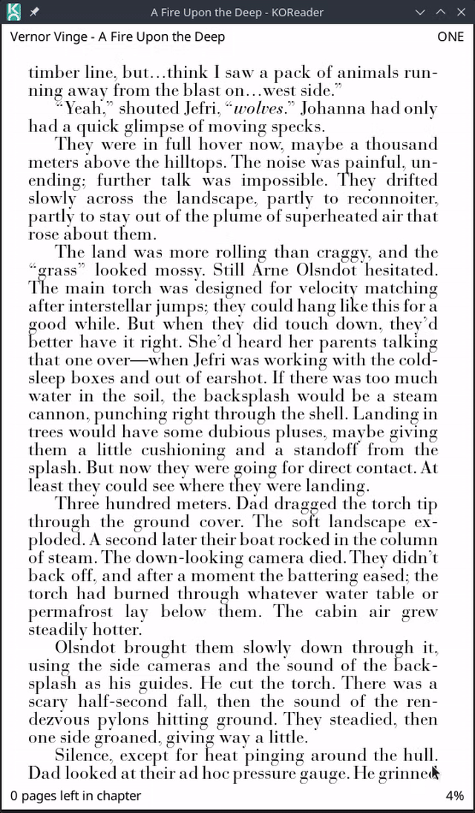
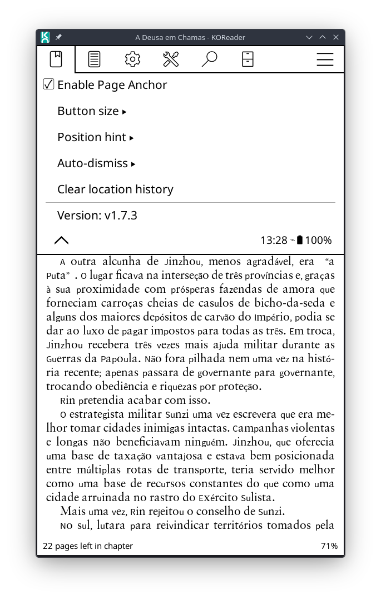

# Page Anchor

Page Anchor adds a compact floating control to KOReader's reading screen. It
exposes KOReader's native previous/next-location history without making you
open the navigation menu, so temporary review trips do not replace your
reading position.

## Example

1. You are reading page 100.
2. Use **Go to page**, the skim bar, the table of contents, Book Map, a
   bookmark, a search result, or an internal link to jump to page 50.
3. A floating `100 →` control appears on the side that leads forward in
   the book. Continue reviewing through page 55.
4. Tap `100 →` to return to page 100.
5. KOReader records the position you just left, so the control now offers
   `← 55` on the backward side. Tap it to continue the review from page 55.
6. Tap `✕` at any time to remain at the current location and dismiss all
   floating navigation indicators. That location becomes the new reading
   reference used for subsequent navigation.

The same flow works when the temporary jump is ahead of the current reading
position. Each destination is a separate rounded button: earlier locations
appear on the physical backward side and later locations on the physical
forward side. The sides and arrows automatically reverse for right-to-left
books. A centered `✕` button accepts the current location, clears the
temporary navigation history, makes the current location the new reference,
and hides all indicators.

## Why it uses KOReader's native history

KOReader already stores exact document locations when standard navigation
tools make a jump. For reflowable books this includes the XPointer; for fixed
layout documents it includes the page view context. Reusing that history is
more precise than storing only a page number, and remains compatible with the
built-in **Go back to previous location** and **Go forward to next location**
commands.

Page Anchor also maintains an explicit reading reference. Normal forward
reading advances it; going back one page is tolerated, while moving farther
back offers a return to the reference. This also covers third-party tools that
jump without adding the origin to KOReader's history.

## Settings

While reading, open **Page Anchor** in the navigation menu. You can:

- show or hide the floating control;
- show only arrows or include the destination position;
- display the destination as a page number or book percentage;
- clear KOReader's current location history.

Navigation buttons use SVG icons bundled with Page Anchor and the same rounded
border, icon size, base height and padding as Quick Dock's main buttons.
Their placement is automatic: for left-to-right books, later locations are on
the right and earlier locations are on the left; right-to-left books reverse
that mapping.

The existing KOReader gesture actions for previous and next location continue
to work with the same history.

## Installation

1. Copy `pageanchor.koplugin/` into KOReader's `plugins/` directory.
2. Restart KOReader.
3. Make sure **Page Anchor** is enabled under plugin management.

## Compatibility and limitations

- Intended for recent KOReader versions.
- Works with reflowable and fixed-layout documents.
- Location history is session-based, matching KOReader's native behavior; it
  is cleared when the document is reopened.
- A single backward page turn is tolerated. Moving farther back offers the
  last confirmed reading reference; standard KOReader navigation tools also
  add their own history entries before jumping.

## Screenshots

