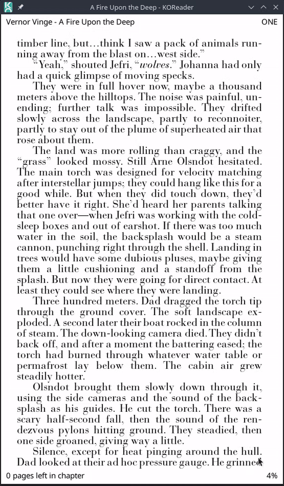
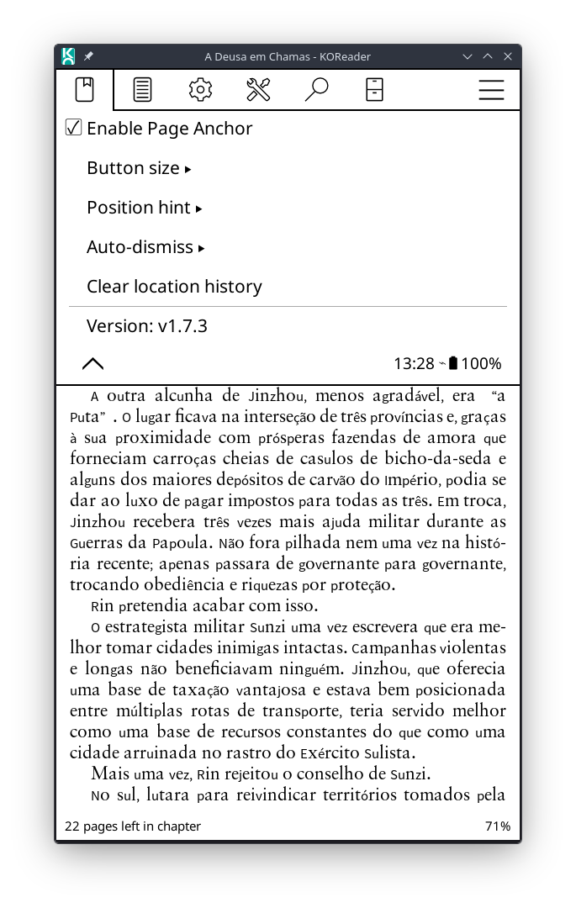

# Page Anchor 

Page Anchor adds a compact floating control to KOReader's reading screen.
When you jump somewhere else in the book, it pins your reading position as
an anchor and gives you a one-tap way back, so temporary review trips do not
replace your reading position.

## Features

- A floating control that appears automatically after a jump: an arrow
  segment that leads back to where you came from, docked to an anchor
  segment.
- Detects jumps made with KOReader's navigation tools (Go to page, skim bar,
  table of contents, Book Map, page browser, bookmarks, search results,
  internal links, next/previous chapter) whatever their distance, and falls
  back to a page-distance check for tools that jump without announcing it.
- Survives font, margin and orientation changes: locations are stored
  exactly (XPointer for reflowable books, page view context for fixed
  layout), so re-pagination is never mistaken for navigation.
- Hold any segment to see where it leads: chapter title plus a page or
  percentage, measured against the book or the chapter.
- Automatic side/arrow mirroring for right-to-left books.
- Inactivity timeout that only hides the control: by default it shrinks to
  a narrow anchor tab glued to the side of the screen, and one tap on the
  tab brings the full control back. The anchor is kept until you dismiss it,
  or, optionally, until it has stayed hidden longer than a set time.
- Gesture actions (also usable from Quick Dock or hardware keys) to show or
  hide the buttons, jump between the anchor and the return point, and
  discard the anchor.
- One tap on the anchor segment accepts the current location as the new
  reading position and dismisses the control, with a few seconds to undo
  it right where the buttons were.
- Pin an anchor by hand before exploring: a pinned anchor survives any
  number of trips away and back, plain page turns included, until you
  discard it.

## Example

1. You are reading page 100.
2. Use **Go to page**, the skim bar, the table of contents, Book Map, a
   bookmark, a search result, or an internal link to jump to page 50.
3. A floating control appears on the side that leads forward in the book:
   an arrow pointing back to page 100, docked to an anchor button. Continue
   reviewing through page 55.
4. Tap the arrow to return to page 100.
5. Page Anchor remembers where you were, so the control now points the
   other way, to page 55, with the anchor button highlighted to show you
   are at the anchor. Tap the arrow to continue the review from page 55, or
   just keep reading: after reading forward past the anchor (1 page by
   default) the control goes away on its own. Stepping back a page to
   re-read keeps it.
6. Tap the anchor button at any time to stay at the current location and
   dismiss the control. That location becomes the new reading reference.

The same flow works when the temporary jump is ahead of the current reading
position: earlier locations appear on the physical backward side and later
locations on the physical forward side, reversed for right-to-left books.
Hold the arrow to see the destination, or the anchor button to see what
tapping it would do. A downward swipe starting on the control also
dismisses it.

After a while without navigation (30 seconds by default) the control
shrinks to a narrow anchor tab glued to the same side of the screen. Tap
the tab to bring the buttons back; the anchor and the return point are kept. A new jump, or
arriving back at the anchor, also brings them back.

By default hidden buttons wait until you dismiss them. You can instead set
a time limit (**Discard when hidden for**): once the buttons have stayed
hidden that long, the anchor is discarded and the current page becomes
your reading position, as if you had tapped the anchor button.

## Gesture actions

Page Anchor adds these actions to KOReader's gesture manager (and so to
Quick Dock and hotkeys), in the **Reader** section of the actions list:

- **Page Anchor: show/hide buttons**: brings hidden buttons back, or hides
  visible ones.
- **Page Anchor: go to anchor / return point**: same as tapping the arrow:
  back to the anchor while away from it, back out to the return point once
  there.
- **Page Anchor: pin anchor here**: pins the anchor at the current
  position (see below).
- **Page Anchor: discard anchor**: same as tapping the anchor button.
- **Page Anchor: restore discarded anchor**: brings back the anchor and
  return point you last discarded.

Each action confirms itself with a short notification, following
KOReader's own setting for notifications from gestures.

## Pinned anchor

Use **Pin anchor here** (menu or gesture action) to mark your position
before you start exploring. Any move away from it, even ordinary page
turns, offers the way back. Unlike an anchor created by a jump, a pinned one
is not resolved when you return to it, does not move as you read on, and is
never discarded by the hidden-buttons time limit: it stays until you
discard it.

## Undoing a discard

Right after you discard the anchor (anchor button, downward swipe or
gesture action), a notice with an undo arrow appears for 3 seconds where
the buttons were. Tap it to bring the anchor and the return point back. Later,
**Restore discarded anchor** in the menu (or its gesture action) does the
same, as long as no new anchor has been set since. If you've moved after
discarding, the current position becomes the return point.

## How it detects jumps

KOReader's navigation tools record the current location in KOReader's
location history right before they jump. Page Anchor watches for that and
treats the next position change as a jump, so even a short one (Go to page
from 100 to 102) pins an anchor, while ordinary page turns never do.

For tools that jump without recording a location, Page Anchor also keeps a
reading reference. Reading forward advances it; one page turn back is
tolerated; moving farther back or more than two page turns ahead offers a
return to it. Distances are counted in page turns, so two-page mode and
hidden non-linear flows behave like single-page reading.

Page Anchor keeps its own anchor and return point and does not modify
KOReader's location history, so the built-in **Go back to previous
location** / **Go forward to next location** commands keep working as
before, independently.

## Installation

Copy the plugin folder to KOReader's `plugins` directory:

```text
pageanchor.koplugin/
├── _meta.lua
├── main.lua
├── pageanchor_l10n.lua
├── icons/
│   ├── anchor.svg
│   ├── chevron-left.svg
│   ├── chevron-right.svg
│   └── undo.svg
└── modules/
    └── history.lua
```

The final path should look like this:

```text
koreader/plugins/pageanchor.koplugin/
```

Then restart KOReader and make sure **Page Anchor** is enabled under plugin
management.

## Configuration

While reading, open **Page Anchor** in the navigation menu. You can:

- enable or disable the floating control;
- choose the button size (small, medium, large);
- choose what the hold hint shows: page number or percentage, of the book or
  of the current chapter, or the chapter title only;
- set the inactivity timeout that hides the control (the anchor is kept),
  whether hiding leaves an anchor tab or nothing at all, how long hidden
  buttons wait before the anchor is discarded (or never), and after how
  many pages read forward past the anchor the return point is dropped;
- pin the anchor at the current position;
- show the floating buttons again after the timeout hid them;
- discard the anchor and the return point and keep reading from the current
  position, or restore the last discarded one.

Navigation buttons use SVG icons bundled with Page Anchor and the same rounded
border, icon size, base height and padding as Quick Dock's main buttons.
Their placement is automatic: for left-to-right books, later locations are on
the right and earlier locations are on the left; right-to-left books reverse
that mapping.

## Known limitations

- Intended for recent KOReader versions.
- Works with reflowable and fixed-layout documents.
- The anchor and return point are session-based; they are cleared when the
  document is reopened.
- Jumps made by third-party tools that don't record a location in
  KOReader's history are only detected when they move farther than the
  reading tolerance (one page turn back, two forward).

## Uninstalling

Remove the folder:

```text
koreader/plugins/pageanchor.koplugin/
```

Then restart KOReader.

Settings saved in KOReader may remain until manually removed from KOReader's
settings storage, but they will not have any effect once the plugin is
removed.

## Screenshots



