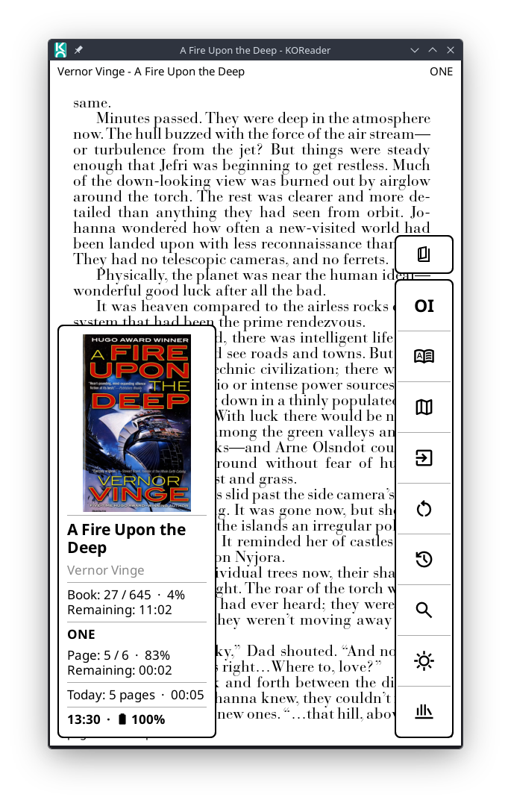
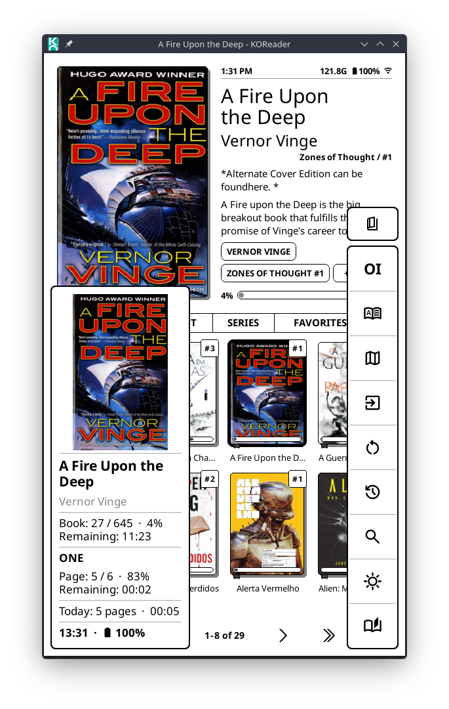

# Quick Dock 

Quick Dock adds a floating action dock with lighting controls and an optional information panel to KOReader. It is designed for touch devices and can be assigned to any gesture supported by KOReader.

## Features

- Floating dock anchored near the lower-left or lower-right corner, without touching the screen edges.
- Two dock shapes: a column beside the screen edge (the default) or an arc around the lower corner for one-handed use, with the information panel along the top of the screen. See [Arc dock](#arc-dock).
- Fixed placement while open: dragging over the dock does not move it away from its selected side.
- Wi-Fi and night mode run in place and keep the dock open; every other configured action closes it before dispatch.
- Gesture-following position enabled by default, opening the dock on the same half of the screen where the assigned gesture started.
- Compact icon buttons using the same scaled dimensions and standard `ButtonDialog` corner radius as Selection Toolbar.
- Three selectable dock scales: Small keeps the original dimensions, Medium increases them by 20%, and Large by 40%.
- Unlimited configurable actions through KOReader's native Dispatcher action picker.
- Configurable button order.
- Optional automatic context visibility for native KOReader actions, with per-action manual overrides.
- Automatic pagination before the enabled buttons would overflow the configured maximum dock height (100%, 60%, or 33% of the screen): the up arrow opens the next page and the down arrow returns to the previous page, without a scrollbar. Only the dock is replaced: the information panel and any status message stay as they are, and the page change is a single non-flashing screen update. The lighting columns follow the resulting action-dock height.
- An optional separate button above the dock moves it immediately between the left and right sides.
- An optional separate close button can be placed at the top of the dock's external controls. It uses `close.svg`, is disabled by default, and has the same height as the side-switch and frontlight toggle buttons.
- Configurable closing method: one block at a time by default, or all blocks at once using the smallest encompassing rectangle and a non-flashing UI update.
- Optional vertical frontlight slider in a separate column beside the action buttons, with a circular thumb, live brightness adjustment, and a dedicated frontlight toggle button.
- Optional second lighting column for frontlight warmth on supported devices, using each device's native warmth range.
- Optional information panel on the screen edge opposite the dock. It can show reading information, book statistics, the covers of recent documents (tap one to open it), network information, or any combination; when two or more are enabled, one highlighted button immediately above the action dock cycles through them without closing the dock.
- Holding a dock button shows its help text in the compact opposite-edge status block above the information panel instead of opening a modal message.
- Night mode and Wi-Fi execute in place without destroying and rebuilding the dock.
- Wi-Fi progress appears in a compact opposite-edge status panel instead of KOReader's informational popups during inline toggles.
- Reader/browser button:
  - opens the previous document from the file browser;
  - returns to the file browser while reading;
  - resumes the parked reader when Bookshelf is open over it.
- The reader/browser button is fixed at the beginning of the action group on the first pagination page and can be hidden in the plugin settings. It is not repeated on later pages. Its icon changes between `exit_reader.svg` in the active reader and `last_doc.svg` in the file browser or Bookshelf.
- Context-aware search button:
  - opens file search in the file browser;
  - opens full-text search while reading;
  - opens Bookshelf's library search while Bookshelf is in the foreground.
- The History action opens Bookshelf's Recent shelf both from Bookshelf and from a book opened through it, and keeps KOReader's native history behavior when that integration is unavailable.
- Interactive night-mode button using `day_mode.svg` or `night_mode.svg` according to the active display mode.
- Interactive Wi-Fi button using `wifi_on.svg` or `wifi_off.svg` according to the radio state.
- Night mode uses KOReader's active device listener and Wi-Fi uses its native network manager while the dock remains open. Their state-specific icons are refreshed without background polling.
- Optional per-action custom icons with automatic fallback to KOReader icons.
- Two-letter action abbreviations when neither a custom nor a KOReader icon is available; hold the button to see its full name.

## Installation

Copy the plugin folder to KOReader's `plugins` directory:

```text
quickdock.koplugin/
├── _meta.lua
├── main.lua
├── quickdock_l10n.lua
├── icons/                  # bundled action, chevron and lighting icons — see Custom icons below
└── modules/
    ├── arc_dock.lua
    ├── arc_layout.lua
    ├── context.lua
    ├── controls.lua
    ├── icons.lua
    ├── info_panel.lua
    ├── inline_actions.lua
    ├── menu.lua
    └── widgets.lua
```

The final path depends on the device:

- Kindle: `/mnt/us/koreader/plugins/quickdock.koplugin`
- Kobo: `/mnt/onboard/.adds/koreader/plugins/quickdock.koplugin`
- Android: `<KOReader data directory>/plugins/quickdock.koplugin`

Then restart KOReader.

## Default buttons

From the bottom upward:

1. Reader/browser button: open previous document / file browser / return from Bookshelf to the reader
2. Toggle Wi-Fi
3. Toggle night mode
4. Search current context
5. History

Brightness is controlled by the dedicated slider, so incremental brightness buttons are no longer part of the initial configuration. They remain available in KOReader's native action selector for users who prefer them. Unavailable device actions are automatically omitted by KOReader.

## Configuration

In the file browser or reader, open:

`Top menu > Tools > Quick Dock`

The settings follow the same grouped layout as the other plugins in this repository:

- `Show Quick Dock`: opens the dock immediately.
- `Behavior`: controls where the dock opens and how its visible blocks close.
  - `Dock side: <current side>`: selects `Left`, `Right`, or `Follow gesture side`. Following the gesture is enabled by default, and the configured fixed side is used as a fallback when the dock is opened without gesture coordinates.
  - `Dock and panel closing`: selects `One block at a time` (the default sequential behavior) or `All blocks at once` (one non-flashing update over the smallest rectangle containing the visible elements).
- `Actions`: controls configurable actions, extra buttons, and context visibility.
  - `Configured actions`: opens KOReader's native action selector and shows the current number of configured actions.
  - `Extra buttons`:
    - `Show reader/browser button`: shows the first dock button; it opens the file browser while reading, opens the last document from the file browser, and returns from Bookshelf to the reader.
    - `Show side-switch button`: shows a button that moves the dock to the other side without opening the settings: above the column dock, or inside the arc next to its start.
    - `Show close button`: shows a button that closes the dock: above the column dock, stacked with the other fixed controls, or inside the arc.
  - `Action visibility`:
    - `Automatic visibility`: automatically separates native reader and file-browser actions.
    - `Per-action visibility`: displays the automatic result and controls manual overrides for each action.
- `Appearance`: controls scale, visible panels and columns, and icon customization.
  - `Dock layout`:
    - `Dock shape: <current shape>`: selects `Column` (the default) or `Arc`. See [Arc dock](#arc-dock).
    - `Dock scale: <current scale>`: selects `Small`, `Medium`, or `Large`. The selected scale applies to the buttons, icons, chevrons, lighting columns, information panel, and pagination calculation. In the arc, `Fill the arc when there are few actions` may enlarge the buttons beyond this size.
    - `Maximum dock height: <current percentage>`: limits the dock (the action, brightness, and warmth columns, or the arc) to approximately `100%`, `60%`, or `33%` of the screen height. Buttons are paginated when they reach the selected limit; the exact height can vary slightly to preserve complete button rows and usable navigation controls. The default is `100%`.
    - `Arc options` (available with the `Arc` shape; see [Arc dock](#arc-dock)):
      - `Arc angle: <current angle>`: tilts the arc between `25°` and `65°`; `45°` (a quarter circle) is the default.
      - `Show band behind buttons`: draws the arc's buttons on a white band (the default) or lets each one float on the page with its own outline.
      - `Fill the arc when there are few actions`: spreads each page's buttons along the whole arc and, when every action fits on one page, enlarges them up to 1.5 times. Button size then varies with the number of actions. Disabled by default.
      - `Empty space: <position>`: with filling disabled, leaves the unused part of the arc `At the end, near the side edge` (the default) or `At the start, near the bottom edge`. The floating buttons follow: they start at the bottom end in the first case and at the side end in the second.
  - `Information panel`: one entry per panel mode, checked when that mode is shown. Each opens a submenu with `Show this panel` and the mode's own options; the modes enabled here are the ones the panel-switch button cycles through, in this order.
    - `Reading information`: the Mini Receipt-inspired reading content. Enabled by default. Option: `Show book cover`.
    - `Book statistics`: the open book's statistics panel (see [Book statistics panel](#book-statistics-panel)). Disabled by default. Option: `Show book cover`.
    - `Recent documents`: covers of recently opened documents (see [Recent documents panel](#recent-documents-panel)). Disabled by default. Option: `Documents to show: <count>`, the maximum number of documents: 3, 6 (the default), 9, 12, 18, or 24.
    - `Network information`: Wi-Fi state and each interface's MAC, SSID, IP, and gateway. Disabled by default.
    - `Show book cover` (in the reading and statistics submenus) is one shared setting: it shows or hides the open document's cover in both panels, above the text in the side panel, or to its left in the arc dock's top panel.
    - `Panel text alignment`: aligns every line of every panel, including the clock and battery, to the `Left`, `Center`, or `Nearest screen edge`. The last option aligns left when the panel is on the left and right when it is on the right. `Nearest screen edge` is the default.
  - `Lighting controls`:
    - `Show frontlight control`: shows or hides the brightness slider and light toggle on devices with a frontlight: a column beside the column dock, or a button inside the arc.
    - `Show warmth control`: shows or hides the optional warmth slider on devices with natural-light support: a second column beside the column dock, or a second button inside the arc.
  - `Custom icon filenames`: lists the custom SVG and PNG names accepted for every action.
- `Reset`:
  - `Reset behavior to defaults`: restores gesture-following placement, right-side fallback, and one-block-at-a-time closing while preserving actions, extra buttons, and appearance.
  - `Reset actions to defaults`: restores the initial actions and their order after confirmation without changing the other plugin settings.
  - `Reset behavior and actions`: additionally restores extra buttons, default actions, order, and visibility while preserving appearance.
- `Gesture setup`: displays instructions for assigning the dock to a KOReader gesture.
- `Version: v0.25.1`: shows the installed plugin version.

The side selector and visibility options keep their menu open after a change, making it easier to review related settings.

## Gesture setup

1. Open **Settings > Taps and gestures > Gesture manager**.
2. Choose a gesture.
3. Select **Show Quick Dock** from the general actions.

With **Behavior > Dock side > Follow gesture side** enabled, the dock opens on the left or right according to the gesture's starting position. Opening it from the Tools menu, a keyboard action, or any event without screen coordinates uses the last fixed side.

The dock can also be opened from **Tools > Quick Dock > Show Quick Dock**.

## Configuring buttons

Open **Tools > Quick Dock > Actions > Configured actions**. KOReader's native action selector lets you add or remove actions and arrange their order. The first configured action is shown at the bottom of the dock, and subsequent actions grow upward.

Selecting **Nothing** removes every configurable action and remains effective when switching between the file browser and reader. The reader/browser button may still be displayed independently when its visibility option is enabled.

Open **Tools > Quick Dock > Actions > Action visibility > Per-action visibility** to choose one of these options for each configured action:

- **Automatic**: uses the native-action classification when automatic visibility is enabled.
- **Everywhere**: displays the action in every supported screen; this is the default when automatic visibility is disabled.
- **Reader only**: displays the action only while a document is open.
- **File browser and Bookshelf only**: displays the action in the file browser and in Bookshelf, including when Bookshelf is covering a parked reader.

Enable **Tools > Quick Dock > Actions > Action visibility > Automatic visibility** to classify native KOReader actions automatically. Book map, Table of contents, Bookmarks, reading navigation, typography, and document-layout actions are treated as reader-only. File search, folder navigation, sorting, and file-browser display actions are treated as file-browser and Bookshelf only. General actions such as Wi-Fi, lighting, history, and power controls remain available everywhere.

Manual selections always override the automatic result. Unknown actions and actions registered by other plugins default to **Everywhere**. At the top of the visibility menu, **Use automatic visibility for all actions** clears manual overrides when automatic mode is enabled; with automatic mode disabled, the same command is shown as **Show all actions everywhere**.

The **Show close button**, **Show side-switch button**, and **Show reader/browser button** options independently control those fixed controls. The reader/browser and side-switch buttons are enabled by default; the close button is disabled by default. If enabled, it uses `icons/close.svg` or `icons/close.png`, then KOReader's system `close` icon, and finally the text **Close** when no icon is available. When both information types are enabled, an automatic panel-switch button is placed closest to the action dock, below the side-switch and close controls. The frontlight toggle follows the visibility of the complete frontlight column.

## Information panels

The information panel appears at the opposite edge of the screen: when the dock opens on the left, the panel opens on the right; when the dock opens on the right, the panel opens on the left. It is bottom-aligned using the same screen margin as the dock and uses the same border, white background, and rounded-corner style as its buttons. Reading information is enabled by default, while network information is optional.

The open book's cover is also enabled by default and appears centered at the top of the reading panel when one is available. Quick Dock obtains it through KOReader's current-document cover API, scales it down once to the panel's maximum dimensions, and reuses that thumbnail while the same document and dock scale remain active. Missing covers are cached as unavailable too, avoiding repeated extraction attempts. There is no background loading or polling. Configure these options at **Tools > Quick Dock > Appearance > Information panel**.

While reading, the panel shows the document title and primary author, current/total page and book percentage, chapter title and progress, estimated time remaining for the book and chapter, today's pages and reading time, the clock, and battery state. It does not show remaining page counts. Stable page labels are used for the displayed book page numbers when enabled, while percentages and estimates continue to follow actual page turns.

In the file browser or Bookshelf, no document-specific fields are invented: the reading panel shows the available daily reading summary, clock, and battery state. Reading-time fields appear only when KOReader's Statistics plugin is enabled and has data. The statistics API is queried once when the dock opens, and the same snapshot is reused across pagination and side changes; there is no timer, background polling, or global ReaderUI/FileManager patch, and the reading and network panels never touch the database directly (the statistics panel's single read-only query is described below).

The network panel displays the current Wi-Fi state and reads the available interface, MAC, SSID, IPv4/IPv6, and gateway details the same way KOReader's own network information does, but without its gateway ping: that test is synchronous, blocks the interface until it answers or times out, and keeps the radio busy, so the panel only reads the interface state already known to the system and sends nothing over the network. This data is collected when the network panel is opened or selected and refreshed from KOReader's connection events when the dock's Wi-Fi button changes state; there is no background polling. With two or more panels enabled, one square button immediately above the action dock cycles through them (Reading, Statistics, Recent documents, Network, skipping disabled ones) without rebuilding or closing the dock. It uses the same dimensions, border, rounded corners, and press feedback as the frontlight toggle. Its icon indicates the panel currently visible: `reading_info.svg` (with the system open-book icon as fallback) for Reading, `stats.svg` for Statistics, `recent_info.svg` (with `history.svg` as fallback) for Recent documents, or `network_info.svg` for Network. Holding the button describes the current panel and the tap action.

### Book statistics panel

Optional and disabled by default (`Appearance > Information panel > Book statistics > Show this panel`). It shows the open book's cover (governed by the same `Show book cover` option as the reading panel), title and primary author, then:

- time read and estimated time left;
- progress in percent;
- average daily reading time for this book and reading speed in pages per minute;
- how many days ago the book was started, with the start date below;
- the estimated end date.

Everything comes from KOReader's Statistics plugin, using the same definitions as its own book statistics screen: the reading time and average page time are read from the values it already keeps in memory (including pages not yet flushed to its database), the daily average is the reading time divided by the number of distinct days with reading, and the end date is today plus the days the remaining time would take at that daily average. The start date and the number of reading days are the only values KOReader does not keep in memory, so they come from one read-only aggregate query over the current book, made only when this panel is collected. Nothing is written, cached, or polled.

Any value KOReader cannot supply is shown as `N/A` instead of being invented: when the Statistics plugin is disabled (a note says so), when the book has no recorded reading yet (KOReader's placeholder average page time is ignored), or when no document is open.

### Recent documents panel

Optional and disabled by default (`Appearance > Information panel > Recent documents > Show this panel`). It shows the covers of the most recently opened documents from KOReader's history, newest first, up to the number chosen in `Documents to show`. Documents that no longer exist are skipped, and so is the document open in the reader, since opening it again would do nothing.

Tapping a cover closes the dock and opens that document the same way KOReader's History does: inside the reader it switches documents, and in the file browser it opens the reader. Taps elsewhere on the panel keep the dock open. The covers fill a grid of up to three columns beside the column dock, or a single row along the top of the screen with the arc dock. When the documents do not fit, the panel shows the page number with arrows next to its title; the arrows turn the page in place, and every page keeps the same panel size.

Covers and titles come from the database of KOReader's Cover browser plugin, so no document is opened to show them. A document Cover browser has not indexed yet (for example, one never shown in its mosaic or detailed list view), or one without a cover, appears as a framed tile with its title. Each thumbnail is scaled once and reused while its document stays in the list; thumbnails of documents that leave the list are freed.

## Inline actions and Wi-Fi status

**Toggle night mode** and **Toggle Wi-Fi** always run without closing or rebuilding the dock. Night mode is sent directly to the active KOReader device listener, while Wi-Fi uses the inline flow described below. Every other configurable action, including **Full screen refresh**, closes the dock before being sent through KOReader's Dispatcher and is not reopened automatically.

Wi-Fi uses KOReader's native network manager and its standard connection events, but replaces informational progress popups from an inline toggle with a dock-styled status block. When either information panel is visible, the status block appears directly above it on the same opposite screen edge. When both panels are disabled, the status block uses its bottom-aligned position. Turning on, scanning, connecting, connected, turning off, offline, and timeout/error states are covered. While KOReader reports a pending connection, the connecting status has no display timeout and remains until the connection succeeds, fails, or the dock is closed. Repeated native scan and authentication messages reuse this same overlay instead of closing and recreating it before each forced repaint. Native network selection, password, and confirmation dialogs remain available because they require user interaction; errors raised later inside those interactive dialogs retain KOReader's native presentation.

The same status block displays button help for three seconds when a dock button is held, including pagination arrows and the fixed controls. These messages are non-modal and do not block touches on the dock, lighting sliders, or the underlying screen. A newer Wi-Fi state always replaces an older help message safely.

Quick Dock does not add a second connectivity polling loop. It relies on KOReader's existing checks and schedules only one final timeout check for an attempted connection. Closing the dock also closes its Wi-Fi status block; the underlying network operation continues normally.

## Arc dock

Select **Tools > Quick Dock > Appearance > Dock layout > Dock shape > Arc** to place the dock on a quarter ring around the lower corner of the side where it opens, from a point on the side edge down to the bottom edge. Every point of the ring is about the same distance from the corner, roughly 4.5 cm on any screen, so the thumb of the hand holding the device reaches all of it.

- **Angle**: **Dock layout > Arc options > Arc angle** tilts the arc. The angle is measured between the bottom edge and the line joining the arc's two ends: `45°` is a quarter circle; `55°` and `65°` bring the bottom end closer to the side edge and make the arc taller, while `35°` and `25°` spread it along the bottom edge and make it lower. Other than 45°, the arc is a quarter ellipse with the same area as the circle, so it holds about the same number of buttons; the buttons are spaced evenly along its length.
- **Ring**: a single row with the actions, in the same order as the column from bottom to top: the reader/browser button first, then the configured actions. By default the buttons keep the selected dock scale and the spacing of a full page; when a page has fewer buttons than the arc holds, **Arc options > Empty space** leaves the unused part either at the end next to the side edge (the default) or at the start next to the bottom edge.
- **Filling**: with **Arc options > Fill the arc when there are few actions** enabled, each page's buttons are spread along the whole arc instead, the first at the end next to the bottom edge and the last at the end next to the side edge. When every action fits on one page, the buttons, icons, and fallback labels also grow, up to 1.5 times the selected dock scale, to close the gaps, so their size varies with the number of actions and the dock scale only sets the smallest size. Paginated docks keep the selected scale.
- **Floating buttons**: the fixed controls float inside the ring, on a smaller arc that starts at the same end as the actions (the bottom end, or the side end when `Empty space` is `At the start` and filling is disabled), spaced as far from each other as from the ring: the side switch first, then brightness, warmth, the information-panel switch, and the close button, each following its own visibility option.
- **Pages**: when the actions do not fit, the last item of a full page is the next-page arrow, at the end next to the side edge, and on later pages the first item is the previous-page arrow. Swiping or dragging along the ring also turns the page: toward the bottom edge for the next page, toward the side edge for the previous one. Pages change in place, without closing the dock or the information panel.
- **Lighting**: tapping the brightness button shows the brightness slider in place of the actions, along the same ring: the light toggle at the end next to the bottom edge and the track up to the side edge, dimmest to brightest. The warmth button does the same for warmth, with the button that shows the current level at the bottom end. The selected floating button gets a thicker ring; tapping it again, or turning the page, brings the actions back. The sliders use the same KOReader frontlight and warmth calls as the column.
- **Information panel**: shown along the top of the screen as a wide panel, with the cover as a thumbnail on the left and the content in up to three columns. Held-button help and Wi-Fi status appear in a strip right below it.

By default the ring is drawn as one opaque band, so changing pages or moving a slider repaints only the dock. With **Arc options > Show band behind buttons** disabled, each ring button floats on the page with its own outline, like the buttons inside the ring; the page between the buttons stays visible, so changing pages also repaints the page under the dock (the e-ink refresh still covers only the dock's area). The brightness and warmth sliders still run on the band: it appears while a slider is open and disappears when the actions come back, so moving a slider repaints only the dock. Tapping outside the band and the floating buttons, including the empty corner inside the ring, closes the dock. The ring's size follows the dock scale and the maximum dock height; it always keeps room for three action positions and for the floating buttons inside it.

## Lighting controls

On devices with a frontlight, the slider is enabled by default and appears in its own column on the inner side of the action dock. Drag or tap toward the top to increase brightness and toward the bottom to decrease it. The circular thumb follows the active brightness level.

A separate compact button at the bottom of this column toggles the frontlight. It uses `icons/light_on.svg` while the light is active and `icons/light_off.svg` while it is off. Turning the light off disables and dims the slider until the same button turns it back on.

The frontlight and warmth columns have the same total height as the rendered action-button dock, including when its maximum height is set to 60% or 33%. Each slider fills the space above its bottom button, and all columns remain aligned along the bottom edge. Disable **Tools > Quick Dock > Appearance > Lighting controls > Show frontlight control** to remove the brightness controls.

On devices with natural-light support, **Show warmth control** adds a second optional column. Tap or drag upward for a warmer tone and downward for a cooler tone. Quick Dock uses KOReader's native warmth conversion, so devices with ranges such as 0–10, 0–24, or 0–100 retain their actual hardware steps. The control is disabled while the frontlight is off and reads the value only while being drawn or operated; it does not poll in the background.

The warmth column is enabled by default on supported devices. Its bottom button uses `icons/warmth.svg`; tapping it displays the current native warmth level. It can be hidden at **Tools > Quick Dock > Appearance > Lighting controls > Show warmth control**. When both lighting columns are enabled, brightness remains next to the action buttons and warmth is placed beside brightness.

Open **Tools > Quick Dock > Appearance > Custom icon filenames** to see the exact custom `.svg` and `.png` filenames for every dock action and fixed control, including the frontlight states.

## Bookshelf compatibility

When the Bookshelf plugin is displayed over a parked reader, Quick Dock treats it as a separate context. The fixed button changes to `last_doc.svg` and resumes the parked reader instead of sending another `Home` event. This prevents the button from closing Bookshelf while still showing the reader-exit icon.

While Bookshelf is in the foreground, **Search current context** opens its **Search library** dialog. If the reader is above a still-loaded Bookshelf screen, the same button opens the full-text search for the current document. The configured **History** action opens the first shelf whose source is **Recent**, including a renamed or customized Recent shelf. From the reader, it brings the still-loaded Bookshelf back to the foreground already on that shelf. If either integration point is unavailable in the installed Bookshelf version, Quick Dock falls back to the corresponding native KOReader action.

The integration only uses Bookshelf modules that are already loaded. Bookshelf remains an optional plugin and is not loaded or required by Quick Dock.

## Custom icons

Put `.svg` or `.png` files in `quickdock.koplugin/icons/`. The plugin checks custom files before using KOReader's built-in icon.

Resolution order for regular actions:

1. `icons/<dispatcher-action-id>.svg`
2. `icons/<dispatcher-action-id>.png`
3. `icons/<mapped-stock-icon>.svg`
4. `icons/<mapped-stock-icon>.png`
5. KOReader's built-in icon
6. A short abbreviation generated from the action name

The two stateful actions use their state-specific names before the regular resolution order: `day_mode.svg` / `night_mode.svg` and `wifi_on.svg` / `wifi_off.svg`. These files are checked only when the dock is drawn or the corresponding action changes state; there is no periodic polling.

Examples for regular actions include `history.svg`, `increase_frontlight.svg`, and `quickdock_context_search.svg`. The plugin also includes matching chevrons for pagination and changing the dock side, `close.svg` for the optional close button, `exit_reader.svg` / `last_doc.svg` for the reader/browser button, `reading_info.svg` / `stats.svg` / `network_info.svg` (and `history.svg` for recent documents) for the information-panel switch, `light_on.svg` / `light_off.svg` for the frontlight toggle, and `warmth.svg` for the warmth column.

For the reader/browser button, use `exit_reader.svg` while reading and `last_doc.svg` in the file browser or when Bookshelf is covering a parked reader. In that Bookshelf state, the button resumes the reader instead of sending another Home command. The same names with a `.png` extension are also accepted.

## Saved settings

Quick Dock stores its preferences through KOReader's reader settings using these keys:

| Setting key | Purpose |
|---|---|
| `quickdock_actions` | Enabled actions and their order |
| `quickdock_action_contexts` | Per-action reader/browser visibility |
| `quickdock_auto_visibility` | Enables automatic context classification |
| `quickdock_side` | Left or right dock position |
| `quickdock_side_mode` | Selects a fixed position or follows the gesture side; gesture following is the default |
| `quickdock_show_side_button` | Visibility of the floating side-switch button |
| `quickdock_show_close_button` | Visibility of the floating close button; disabled by default |
| `quickdock_show_context_button` | Visibility of the reader/browser button |
| `quickdock_show_frontlight_slider` | Visibility of the frontlight slider column |
| `quickdock_show_warmth_slider` | Visibility of the frontlight warmth column; enabled by default on supported devices |
| `quickdock_show_info_panel` | Visibility of the reading-information panel; enabled by default |
| `quickdock_show_recent_info_panel` | Visibility of the recent-documents panel; disabled by default |
| `quickdock_recent_documents_count` | Maximum number of documents in the recent-documents panel: 3, 6, 9, 12, 18, or 24; defaults to 6 |
| `quickdock_show_network_info_panel` | Visibility of the network-information panel; disabled by default |
| `quickdock_show_info_panel_cover` | Visibility of the open book's cover at the top of the information panel; enabled by default |
| `quickdock_info_panel_text_alignment` | Left, centered, or nearest-screen-edge alignment for all information-panel text |
| `quickdock_dock_size` | Selected Small, Medium, or Large dock scale |
| `quickdock_max_action_dock_height` | Maximum dock-column height as 100%, 60%, or 33% of the screen; defaults to 100% |
| `quickdock_dock_shape` | Column or arc dock; defaults to column |
| `quickdock_arc_angle` | Arc tilt in degrees: 25, 35, 45, 55, or 65; defaults to 45 |
| `quickdock_arc_band` | Draws the arc's buttons on a white band; enabled by default |
| `quickdock_arc_fill` | Spreads and enlarges the arc's buttons to fill the arc; disabled by default |
| `quickdock_arc_empty_space` | Where the arc's unused part stays when not filling: `end` (default) or `start` |
| `quickdock_close_together` | Closes all blocks in one non-flashing update over their smallest encompassing rectangle; disabled by default |

## Localization

Quick Dock follows KOReader's active interface language. Plugin-specific messages are translated into Brazilian and European Portuguese; built-in KOReader messages, page plurals, durations, and device-provided network details use KOReader's own translations. In other interface languages, shared terms use KOReader's catalog and plugin-specific messages fall back to English. Action names come from KOReader's localized action picker, while icon filenames and action IDs remain unchanged.

## Code organization

- `main.lua`: plugin lifecycle, saved state, dock sizing, pagination, information-panel coordination, and action dispatch.
- `modules/controls.lua`: action, context, pagination, side-switch, close, information-panel, frontlight, and warmth control factories.
- `modules/widgets.lua`: low-level slider and button widget classes, fixed positioning, and multi-column layout.
- `modules/arc_dock.lua`: the arc dock widget: the arc as a sampled quarter ellipse, floating-button geometry, painting, hit testing, page swipes, and the arc lighting sliders.
- `modules/arc_layout.lua`: builds the arc dock's pages and floating buttons from the same actions and callbacks as the column.
- `modules/info_panel.lua`: safe collection and rendering of reading, book statistics, recent documents, and network details, covers, statistics, clock, battery, and transient status panels, either on the edge opposite the dock or along the top of the screen.
- `modules/inline_actions.lua`: in-place night-mode and Wi-Fi execution, including Wi-Fi progress redirection and timeout handling.
- `modules/context.lua`: reader, file-browser, and optional Bookshelf integration.
- `modules/icons.lua`: custom/system icon resolution, stateful icons, and safe shared IconWidget patching.
- `modules/menu.lua`: settings menus, action visibility controls, icon-name help, and reset confirmation.
- `quickdock_l10n.lua`: locale-aware translations for plugin-specific interface text, with KOReader gettext fallback.

## Uninstalling

Remove the folder:

```text
koreader/plugins/quickdock.koplugin/
```

Then restart KOReader.

Settings saved in KOReader may remain until manually removed from KOReader's settings storage, but they will not have any effect once the plugin is removed.

## Screenshots



