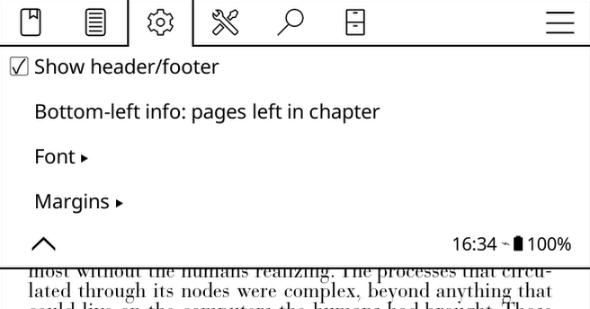
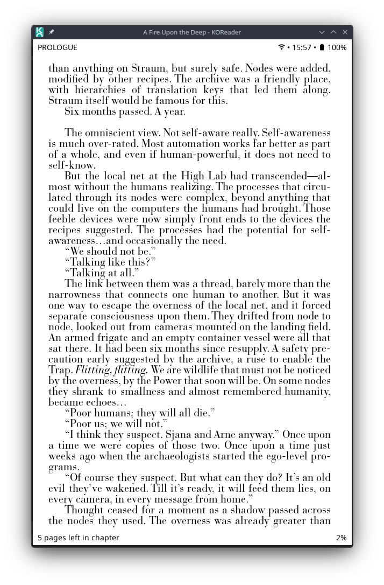
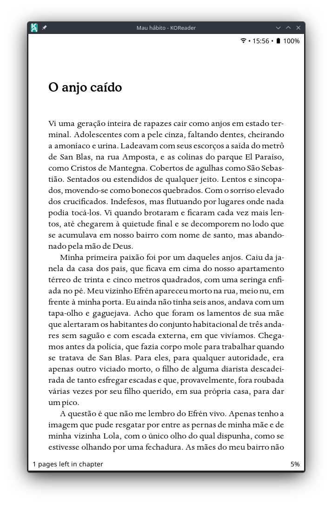

# Reader Header Footer 

Plugin for [KOReader](https://koreader.rocks/) that adds discreet header and footer information while reading.

It displays indicators directly in the document margins, without opening extra bars or changing the reader's main interface.

## Features

The plugin adds four information areas to the reading screen:

- **Top left**: chapter title or author + book title.
- **Top right**: Wi-Fi indicator, time, and battery.
- **Bottom left**: pages left in the current chapter or in the book.
- **Bottom right**: document reading percentage.

The goal is to keep useful information always visible while remaining lightweight and unobtrusive.

## How it works

The plugin is loaded as a KOReader reader module and draws text directly over the top and bottom regions of the page.

It avoids full-screen redraws whenever possible. Instead, it invalidates only the small areas where the indicators are displayed. This reduces flickering and avoids heavy full-page refreshes.

It also includes protection for menus and dialogs: if a KOReader menu is open, indicator updates are deferred until the reader becomes the active window again.

## Displayed information

### Top right

Shows:

```text
Wi-Fi • HH:MM • Battery
```

Example:

```text
 • 14:32 •  87%
```

If the device does not have a battery, or if battery information is unavailable, the battery indicator is omitted.

### Top left

Shows contextual book information:

- on even-numbered pages: `Author • Title`;
- on odd-numbered pages: current chapter title;
- at the beginning of a chapter: the top-left area stays empty to avoid unnecessary repetition.

### Bottom left

Can display one of two pieces of information:

```text
10 pages left in chapter
```

or:

```text
120 pages left in book
```

This behavior can be configured from the plugin menu.

### Bottom right

Shows the percentage of the document that has been read:

```text
42%
```

## Installation

1. Create a folder named:

```text
reader_header_footer.koplugin
```

2. Copy the plugin files into it:

```text
reader_header_footer.koplugin/
├── _meta.lua
└── main.lua
```

3. Copy the folder to KOReader's plugins directory.

On many devices, the path will look similar to:

```text
koreader/plugins/reader_header_footer.koplugin
```

On Kindle devices, it is usually located at:

```text
/mnt/us/koreader/plugins/reader_header_footer.koplugin
```

4. Restart KOReader.

5. Open a book and access the reader menu to configure the plugin.

## Configuration

The plugin adds an item to the reader's main menu:

```text
Header/footer indicators
```

From this menu, you can configure:

### Enable or disable

Turns the indicators on or off without removing the plugin.

### Bottom-left information

Switches between:

- pages left in the current chapter;
- pages left in the book.

### Font

Allows changing the indicator font size.

Supported values:

```text
minimum: 10
default: 16
maximum: 28
```

There is also an option to restore the default size.

### Margins

By default, the plugin tries to follow the document's real margins, aligning the indicators with the reading area.

You can also disable this behavior and define manual margins:

- left margin;
- right margin;
- common side margin for both sides.

Supported values:

```text
minimum: 0
maximum: 300
```

## Saved settings

Preferences are stored in KOReader's settings using the following keys:

```text
reader_header_footer_enabled
reader_header_footer_font_size
reader_header_footer_follow_document_margins
reader_header_footer_custom_left_margin
reader_header_footer_custom_right_margin
reader_header_footer_custom_horizontal_margin
reader_header_footer_left_footer_mode
```

## Automatic updates

The plugin automatically updates the indicators on the following events:

- page change;
- reading position update;
- Wi-Fi state change;
- battery charging state change;
- device resume after suspension;
- minute change, to update the clock.

The battery is checked periodically every 5 minutes.

## Performance

The plugin was designed to be lightweight. Some important decisions:

- uses regional updates instead of full refreshes;
- avoids redrawing while menus or dialogs are open;
- updates the clock only when the minute changes;
- checks the battery periodically, not continuously;
- reuses the current page state, page count, and visible reader area.

## Advanced customization

Some values can be adjusted directly at the beginning of `main.lua`.

### Font size

```lua
local FONT = {
    name = "NotoSans-Regular.ttf",
    default_size = 16,
    min_size = 10,
    max_size = 28,
}
```

### Spacing and positioning

```lua
local LAYOUT = {
    padding = 10,
    top_padding = 2,
    bottom_padding = 10,
    text_clear_extra = 6,
    line_extra_for_region = 8,
    line_extra_for_paint = 4,
    left_right_gap = 16,
}
```

### Default margins

```lua
local INDICATOR_MARGINS = {
    default_follow_document = true,
    default_left = 20,
    default_right = 20,
    min = 0,
    max = 300,
}
```

## Known limitations

- The plugin depends on metadata and table-of-contents information provided by KOReader.
- In documents without a table of contents, the pages-left-in-chapter count may fall back to the pages-left-in-book count.
- The chapter title may be empty if the document does not provide a reliable TOC structure.
- In very unusual layouts, automatic margins may not exactly match the visual text area. In those cases, use manual margins.

## Plugin structure

```text
reader_header_footer.koplugin/
├── _meta.lua   # metadata displayed by KOReader
└── main.lua    # main plugin implementation
```

## Screenshots






## Credits

Custom plugin for KOReader.
