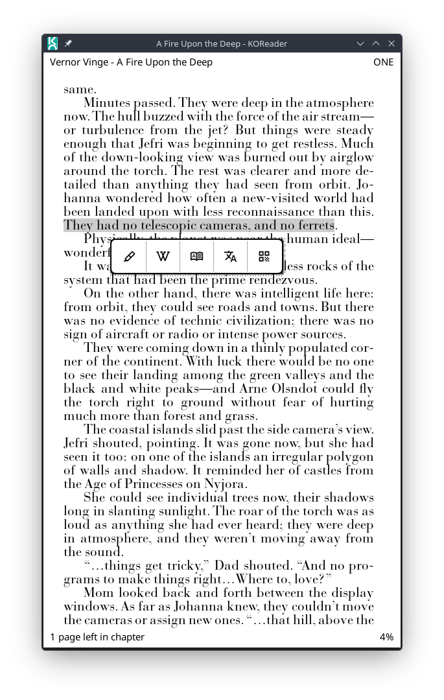
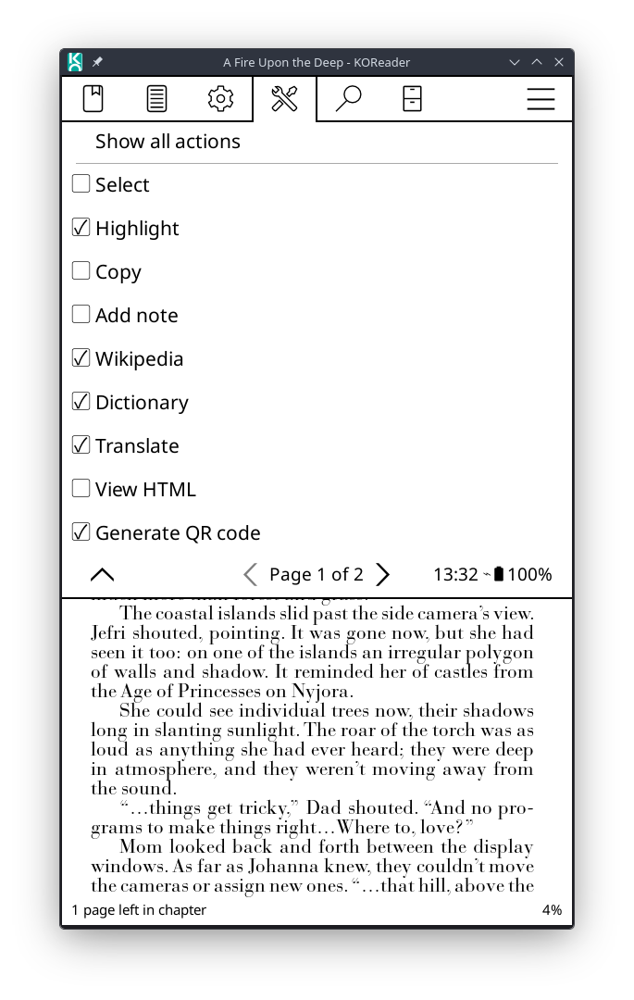
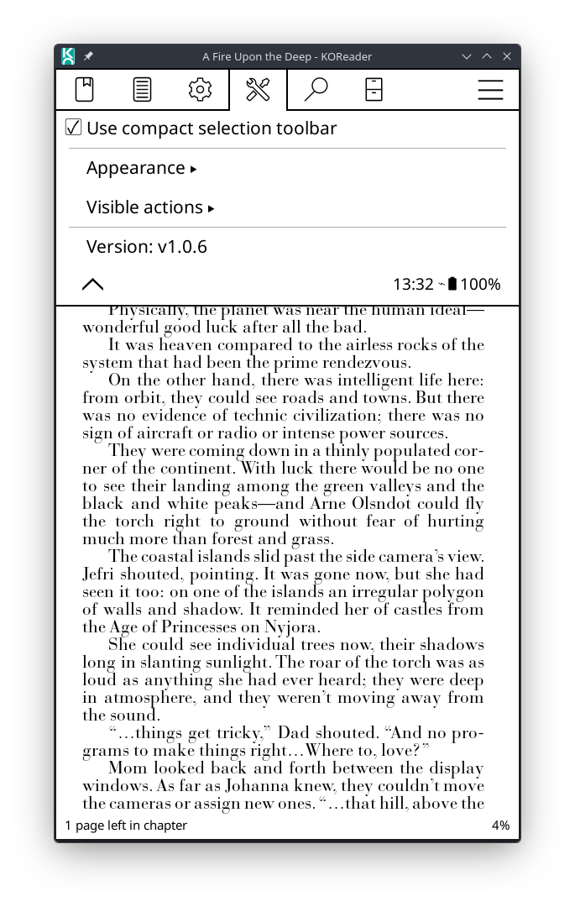

# Selection Toolbar 

A KOReader plugin that replaces the centered text-selection menu with a compact toolbar displayed near the selected text.

## Features

- Replaces KOReader's default highlight menu with a single row of icon buttons whenever more than one word is selected.
- The toolbar appears below the selection when there is enough space, otherwise above it.
- Native actions reuse the original `ReaderHighlight` callbacks, preserving KOReader's default behavior.
- Icons are loaded directly from the plugin's own folder — no need to copy files into internal KOReader directories.
- Reversible: disabling the plugin restores the original menu immediately.

Available actions:

- Select
- Highlight
- Copy
- Add note
- Wikipedia
- Dictionary
- Translate
- View HTML
- Generate QR code
- Search

The `Generate QR code` action uses the native `ui/widget/qrmessage` widget when it is available in the installed KOReader version.

## Installation

Copy the plugin folder to KOReader's `plugins` directory:

```text
selectiontoolbar.koplugin/
├── _meta.lua
├── main.lua
└── icons/
    ├── add_note.svg
    ├── copy.svg
    ├── dictionary.svg
    ├── highlight.svg
    ├── qr_code.svg
    ├── search.svg
    ├── select.svg
    ├── translate.svg
    ├── view_html.svg
    └── wikipedia.svg
```

The final path should look like this:

```text
koreader/plugins/selectiontoolbar.koplugin/
```

Then restart KOReader.

## Configuration

In the reader, open:

`Top menu > Settings > Selection toolbar`

Options:

- `Use compact selection toolbar`: enables/disables replacement of the default menu.
- `Appearance`: controls the toolbar's visual presentation.
  - `Show toolbar shadow`: shows or removes the dithered shadow along the right and bottom edges. The shadow follows the toolbar's rounded corners.
- `Visible actions`: lets you choose which actions appear in the toolbar.
  - `Show all actions`: restores all actions.
  - Other items: enable/disable each toolbar action individually.
- `Version: vX.Y.Z`: shows the installed plugin version.

## Icons

Icons are stored in:

`selectiontoolbar.koplugin/icons/`

The current version loads icons directly from the plugin's own folder. There is no need to copy SVGs to internal KOReader directories or to KOReader's data directory.

Internally, the plugin applies a lightweight patch to `IconWidget` so it can accept direct `.svg`/`.png` file paths passed through the `icon` field. This patch only uses values explicitly defined in the widget, avoiding conflicts with other plugins that also use `IconWidget` or load icons through `file`.

## How it works

The plugin includes a few internal adjustments to reduce repeated work when opening the toolbar:

- icon path caching;
- caching of the `ui/widget/qrmessage` module after the first check;
- cached dithered shadows, shared between toolbar openings of the same size;
- single read of the visible actions when building the toolbar;
- page offset calculation only once before iterating over the selection boxes;
- button metrics centralized in a shared function, including width, height, icon size, and side padding.

When the plugin is closed, the patch applied to the highlight menu and to `IconWidget` is restored when it is still the active Selection Toolbar patch.

## Known limitations

- `View HTML` only appears when the original action exists for the current document, following KOReader's own rule.
- On very narrow screens, the toolbar remains compact, but it may take up a large portion of the available width if all 10 actions are enabled.
- The plugin is reversible: when disabling the `Use compact selection toolbar` option, the original menu is used again.

## Uninstalling

Remove the folder:

```text
koreader/plugins/selectiontoolbar.koplugin/
```

Then restart KOReader.

Settings saved in KOReader may remain until manually removed from KOReader's settings storage, but they will not have any effect once the plugin is removed.

## Screenshots




