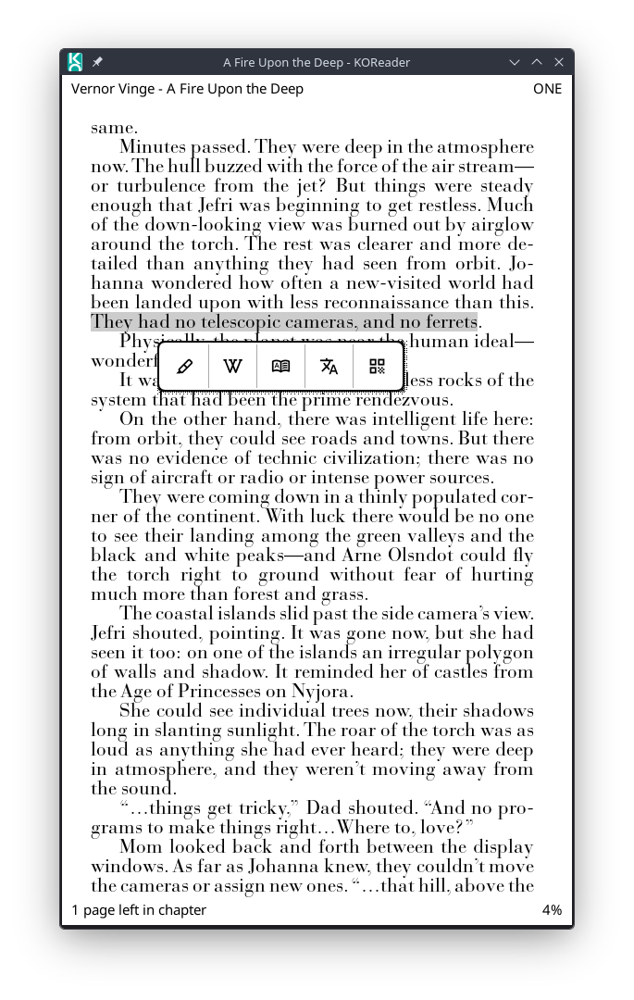
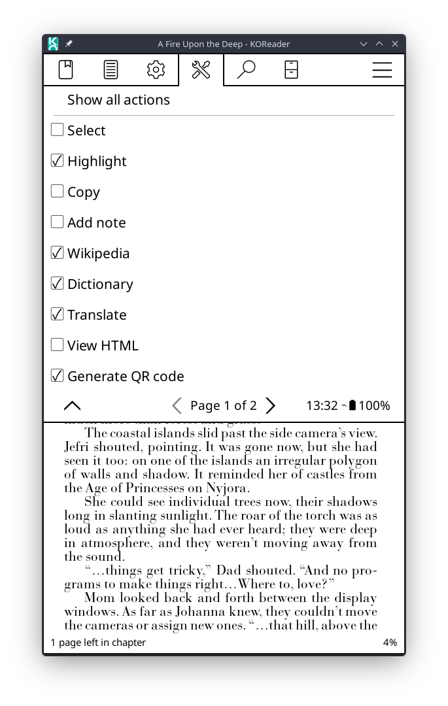
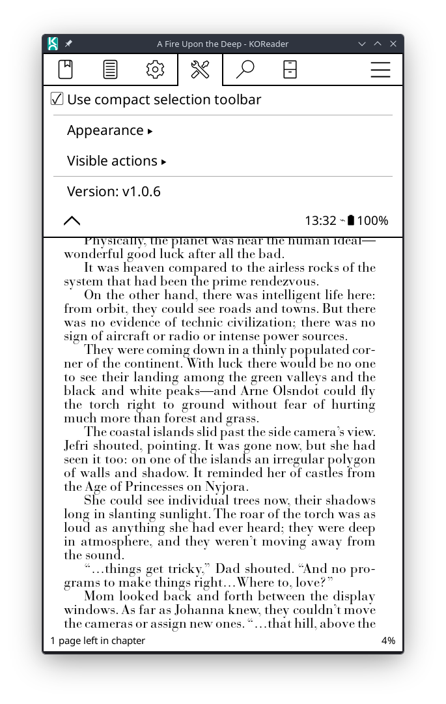

# Selection Toolbar 

A KOReader plugin that replaces the centered text-selection menu with a compact toolbar displayed near the selected text, and adds draggable handles and a margin line marker to adjust and visualize the selection.

The plugin is developed for **EPUB** documents only (KOReader's crengine engine). In PDF, DjVu, CBZ and other paged documents it stays inactive: KOReader's native selection menu is used and the plugin's menu is not shown.

## Features

- Replaces KOReader's default highlight menu with a single row of icon buttons whenever more than one word is selected.
- The toolbar appears below the selection when there is enough space, otherwise above it.
- When the selection fills the screen, the toolbar is pinned to the screen edge opposite to the last selection point (top if you last selected near the bottom, and vice versa), and slid sideways so it covers neither selection handle when the width allows it.
- Native actions reuse the original `ReaderHighlight` callbacks, preserving KOReader's default behavior.
- Icons are loaded directly from the plugin's own folder — no need to copy files into internal KOReader directories.
- Selection handles: while the toolbar is open, a handle is drawn at the start and at the end of the selection. Drag a handle to extend or shrink the selection; dragging one past the other swaps them.
- Cross-page selection: dragging a handle into a page corner continues the selection on the next or previous page, reusing KOReader's own corner-scroll behavior (`Long-press on text > Auto-scroll when selection reaches a corner` must be enabled).
- Line marker: a vertical line in the page margin beside the selected lines, one per visible page in two-page mode.
- Reversible: disabling the plugin restores the original menu immediately.

Available actions:

- Select
- Highlight
- Copy
- Add note
- Wikipedia
- Dictionary
- Translate
- View HTML
- Generate QR code
- Search

The `Generate QR code` action uses the native `ui/widget/qrmessage` widget when it is available in the installed KOReader version.

## Installation

Copy the plugin folder to KOReader's `plugins` directory:

```text
selectiontoolbar.koplugin/
├── _meta.lua
├── main.lua
└── icons/
    ├── add_note.svg
    ├── copy.svg
    ├── dictionary.svg
    ├── highlight.svg
    ├── qr_code.svg
    ├── search.svg
    ├── select.svg
    ├── translate.svg
    ├── view_html.svg
    └── wikipedia.svg
```

The final path should look like this:

```text
koreader/plugins/selectiontoolbar.koplugin/
```

Then restart KOReader.

## Configuration

In the reader, open:

`Top menu > Settings > Selection toolbar`

Options:

- `Use compact selection toolbar`: enables/disables replacement of the default menu.
- `Appearance`: controls the toolbar's visual presentation.
  - `Show toolbar shadow`: shows or removes the dithered shadow along the right and bottom edges. The shadow follows the toolbar's rounded corners.
- `Selection marks`: controls the handles and the line marker.
  - `Show selection handles`: shows the draggable start/end handles (touch devices only).
  - `Show line marker`: shows the vertical line beside the selected lines.
  - `Line marker in right margin`: draws the line marker in the right margin instead of the left one (mirrored for right-to-left interface languages).
- `Visible actions`: lets you choose which actions appear in the toolbar.
  - `Show all actions`: restores all actions.
  - Other items: enable/disable each toolbar action individually.
- `Version: vX.Y.Z`: shows the installed plugin version.

## Icons

Icons are stored in:

`selectiontoolbar.koplugin/icons/`

The current version loads icons directly from the plugin's own folder. There is no need to copy SVGs to internal KOReader directories or to KOReader's data directory.

Internally, the plugin applies a lightweight patch to `IconWidget` so it can accept direct `.svg`/`.png` file paths passed through the `icon` field. This patch only uses values explicitly defined in the widget, avoiding conflicts with other plugins that also use `IconWidget` or load icons through `file`.

## How it works

The plugin includes a few internal adjustments to reduce repeated work when opening the toolbar:

- icon path caching;
- caching of the `ui/widget/qrmessage` module after the first check;
- cached dithered shadows, shared between toolbar openings of the same size;
- single read of the visible actions when building the toolbar;
- page offset calculation only once before iterating over the selection boxes;
- button metrics centralized in a shared function, including width, height, icon size, and side padding.

Selection handles and line marker:

- the marks are painted by a `ReaderView` view module, on the page itself, only while the toolbar opened for a live selection is shown. They are computed on every repaint from the selection's xpointers (`getScreenBoxesFromPositions`), so they follow the selection after a drag or a page scroll.
- while the toolbar is open it is the top widget and receives every gesture, so the handle gestures (`hold`, `pan`, `hold_pan`, `swipe`, `multiswipe`) are registered on the toolbar dialog itself. During a drag only `pan` and `hold_pan` keep it going; any other gesture ends it (the lift may arrive as `pan_release`, `hold_release`, `swipe` or `multiswipe` depending on timing and path), so the toolbar is never left hidden. Only gestures that start on a handle are consumed, and they are handled before the toolbar's own children, so dragging a handle across the toolbar never moves the toolbar. Toolbar buttons keep priority where the toolbar is shown, and the toolbar is placed clear of the handles' touch areas. A tap on a handle does not close the toolbar.
- dragging a handle sets KOReader's hold position to the opposite end of the selection and drives `ReaderHighlight:onHoldPan()`, the same path used by long-press selection and by keyboard selection. Word snapping, page-corner scrolling and selection rendering are therefore KOReader's own.
- the toolbar is hidden while a handle is dragged and re-anchored to the selection on release. Pan events are rate-limited with KOReader's `hold_pan_rate` setting.

When the plugin is closed, the patch applied to the highlight menu and to `IconWidget` is restored when it is still the active Selection Toolbar patch.

## Known limitations

- EPUB only. The plugin is inactive in PDF, DjVu and other paged documents.
- Handles are not shown for saved highlights opened from the page (KOReader's own highlight dialog already offers start/end adjustment for those), only for a new selection.
- A handle whose end of the selection is off-screen (after scrolling across pages) is not drawn until that end is visible again; the visible handle can still be dragged.
- Right-to-left and vertical text are not specifically handled: the handles follow the first and last selection boxes.
- Cross-page dragging in two-page mode is limited to the adjacent page, as in KOReader's native selection.

- `View HTML` only appears when the original action exists for the current document, following KOReader's own rule.
- On very narrow screens, the toolbar remains compact, but it may take up a large portion of the available width if all 10 actions are enabled.
- The plugin is reversible: when disabling the `Use compact selection toolbar` option, the original menu is used again.

## Uninstalling

Remove the folder:

```text
koreader/plugins/selectiontoolbar.koplugin/
```

Then restart KOReader.

Settings saved in KOReader may remain until manually removed from KOReader's settings storage, but they will not have any effect once the plugin is removed.

## Screenshots




