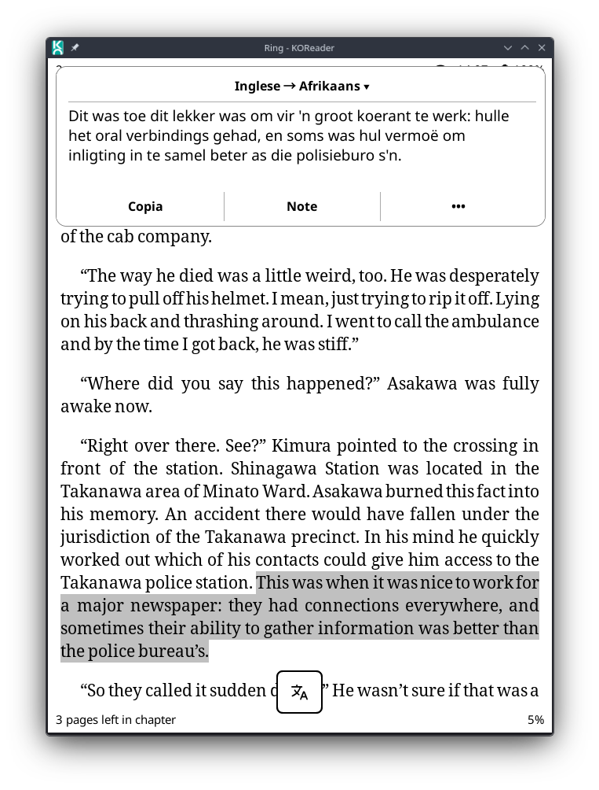
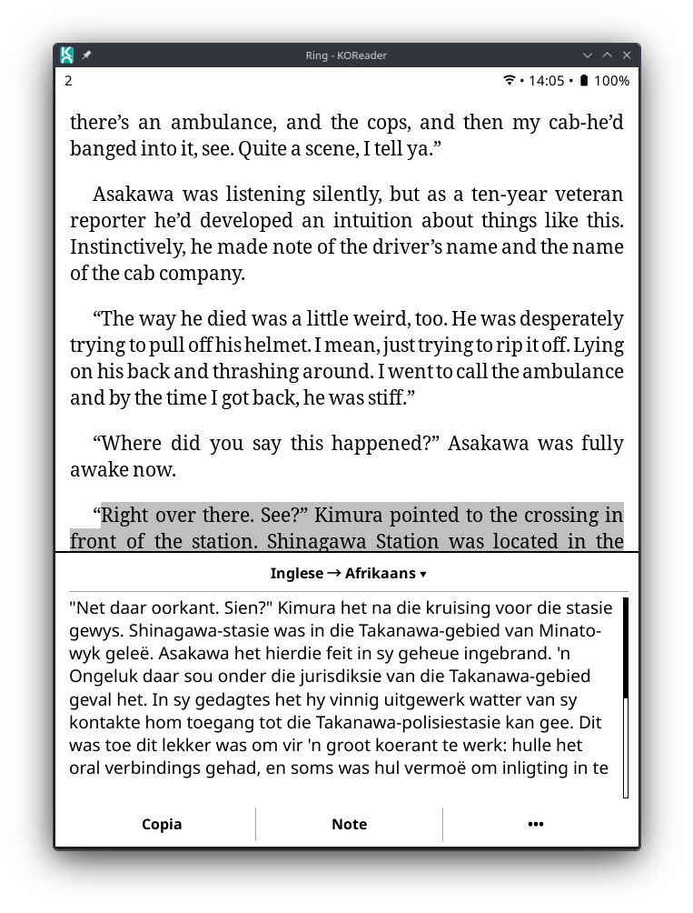
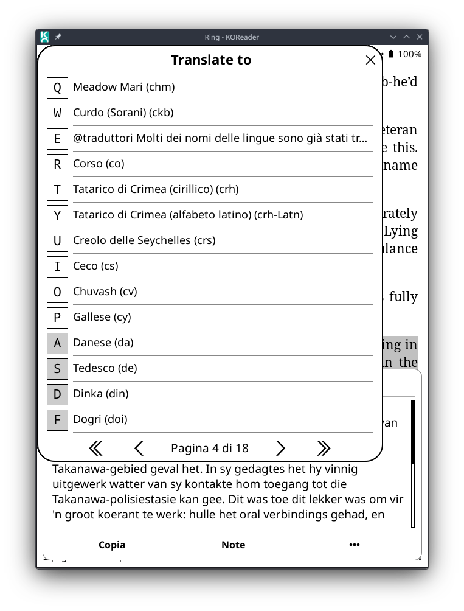
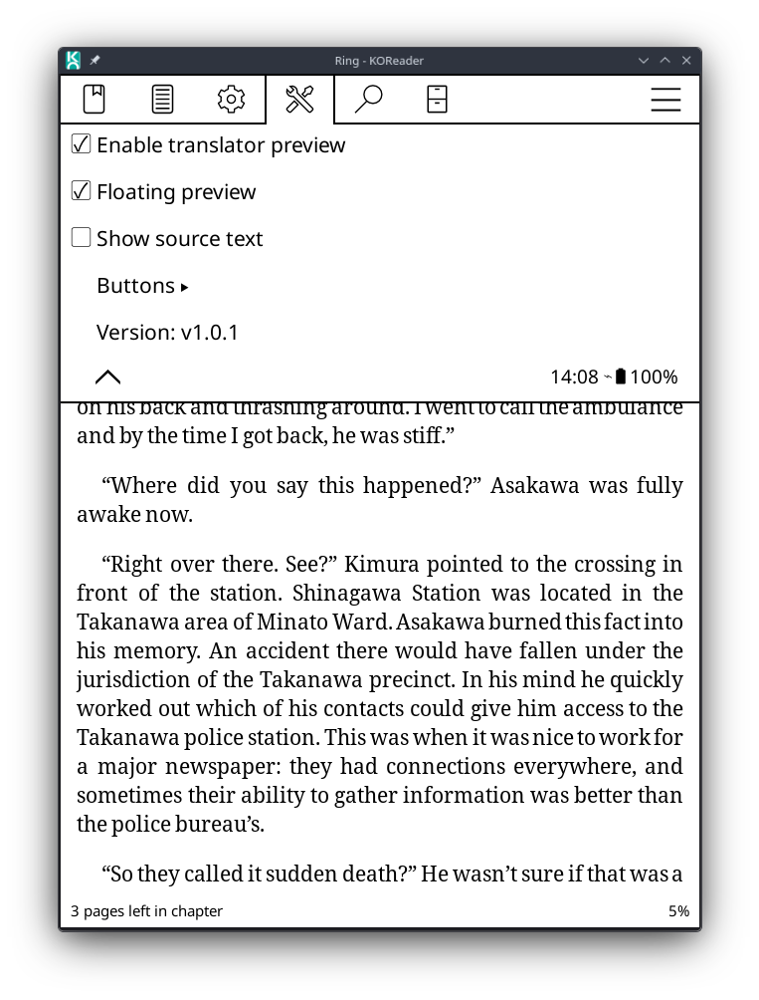

# KOReader Translator Preview 

**Translator Preview** is a KOReader reader plugin that changes the translation flow. Instead of immediately opening KOReader's full translator window, it first shows the translation in a compact, cleaner preview panel.

The preview can be displayed either as a bottom panel or as an optional floating card. It keeps the original KOReader translator available through a compact **•••** button, while making common actions such as copying the translation, saving it as a note, and changing the target language accessible from the preview itself.

The plugin metadata registers it as `translatorpreview` with the display name **Translator Preview**. Its purpose is to show a less intrusive translation preview before opening the full translator view.

## Features

- Shows translation results in a compact preview before opening KOReader's full translator window.
- Supports two preview layouts:
  - **Bottom panel**, displayed at the bottom of the screen;
  - **Floating preview**, displayed as a compact floating card.
- Floating preview automatically chooses whether to appear near the top or bottom of the screen to avoid covering the selected text when possible.
- Uses a clean header with the detected source language and current target language.
- Makes the language header clickable:
  - tap `Source → Target ▾` to open the target language menu;
  - selecting a new language saves the target language and refreshes the translation.
- Keeps the header separator fixed outside the scrollable translation area, so it remains visible while scrolling long translations.
- Uses adaptive preview height for short and medium translations.
- Adds a small bottom safety margin to avoid clipping descenders in the translated text.
- Supports optional source text display below the translation.
- Provides compact action buttons:
  - **Copy**: copies the main translation to the clipboard;
  - **Note**: saves the main translation as a note when the translation comes from a highlight;
  - **•••**: opens KOReader's original translator view.
- Lets the user show or hide optional action buttons from the plugin settings.
- Keeps KOReader's original translator available and restores it when the plugin is disabled or unloaded.
- Adds a version entry in the plugin settings menu.

## Installation

Copy the plugin folder to KOReader's `plugins` directory:

```text
translatorpreview.koplugin/
├── _meta.lua
└── main.lua
```

The final path should look like this:

```text
koreader/plugins/translatorpreview.koplugin/
```

Then restart KOReader.

A minimal `_meta.lua` can look like this:

```lua
return {
    name = "translatorpreview",
    fullname = "Translator Preview",
    description = "Shows translations in a compact preview panel.",
}
```

## Enabling the plugin

After restarting KOReader, open a book and go to the reader menu. The plugin adds a **Translator preview** settings entry.

The menu contains:

- **Enable translator preview**: turns the preview behavior on or off.
- **Floating preview**: switches from the default bottom panel to the floating card layout.
- **Show source text**: shows or hides the original selected text below the translation.
- **Buttons**:
  - **Show copy button**: shows or hides the copy button in the preview;
  - **Show note button**: shows or hides the note button in the preview.
- **Version: vX.Y.Z**: displays the current plugin version.

By default, the preview is enabled, the bottom panel layout is used, the source text is hidden, and the optional action buttons are available according to the saved plugin settings.

## How it works

When selected text triggers KOReader's translator, the plugin intercepts the translator display step before KOReader opens the normal translator view. If the preview is enabled, it queries the configured translation service and shows the main translated result in a compact panel.

The original KOReader translator is still available from the preview. Tapping the **•••** button closes the preview and opens KOReader's native detailed translator view for the same selected text.

The preview header shows the source and target languages:

```text
English → Portuguese (Brazilian) ▾
```

Tapping this header opens the target language menu. When a new target language is selected, the plugin saves it to KOReader's translator target language setting and refreshes the preview with the new translation.

When **Floating preview** is enabled, the plugin attempts to use the current highlight position to choose where the floating card should appear:

- if there is enough room below the selection, the card appears near the bottom;
- if the selected text is low on the screen, the card appears near the top;
- if the selection position cannot be determined, the floating card falls back to the bottom position.

## Controls

### Header

| Element | Action |
|---|---|
| `Source → Target ▾` | Opens the target language menu |

### Buttons

The preview can show these buttons:

| Button | Action |
|---|---|
| Copy | Copies the main translation to the clipboard |
| Note | Saves the main translation as a note when available from a highlight |
| ••• | Opens KOReader's original translator view |

The **Copy** and **Note** buttons can be shown or hidden from the plugin settings. The **•••** button is always shown so the original translator remains accessible.

### Gestures

| Gesture | Action |
|---|---|
| Swipe down | Close preview when using the bottom panel or a floating card anchored near the bottom |
| Swipe up | Close preview when using a floating card anchored near the top |
| Tap outside the preview | Close preview |

## Target language selection

The plugin tries to reuse KOReader's own translator settings menu to build the list of available target languages. This keeps the preview aligned with the languages supported by the current KOReader translator implementation.

If the native language menu cannot be read, the plugin falls back to a compact list of common target languages:

```text
en, pt, es, fr, de, it, nl, ru, ja, ko, zh, ar, hi, tr, pl, sv, da, fi, no, el, cs, ro, uk, vi
```

When a target language is selected, the plugin saves the value to:

```text
translator_to_language
```

and then refreshes the translation preview.

## Configuration

The plugin stores settings through KOReader's reader settings system.

| Setting key | Purpose |
|---|---|
| `translatorpreview_enabled` | Enables or disables the preview |
| `translatorpreview_floating_preview` | Enables or disables floating preview mode |
| `translatorpreview_show_source` | Shows or hides the original source text |
| `translatorpreview_show_copy_button` | Shows or hides the copy button |
| `translatorpreview_show_note_button` | Shows or hides the note button |
| `translator_to_language` | KOReader target language setting updated when choosing a new target language from the preview |

## Preview layout

The preview is composed of three main areas:

1. A clickable language header.
2. A scrollable translation area.
3. A compact action button row.

The separator below the header is a fixed UI line, not part of the scrollable HTML content. This keeps the header visually separated from the translation even when the translation text is scrolled.

The translation content is rendered through `ScrollHtmlWidget`, with a small bottom safety margin to avoid clipping characters such as `g`, `j`, `p`, `q`, and `ç`.

## Performance notes

The plugin keeps the preview lightweight by avoiding unnecessary parsing of detailed translation data. It extracts only the main translated text for the compact preview and leaves the full detailed result to KOReader's original translator view.

It also avoids repeated UI lookups where possible, caches clipboard availability during initialization, and reuses the current reader UI reference when available.

Screen dimensions are still evaluated when the preview is created, so the layout can react correctly to orientation or screen-size changes.

## Notes and limitations

- This plugin is intended for the reader view only.
- It monkey-patches KOReader's translator display method at runtime, so future KOReader changes to translator internals may require adjustments.
- The compact preview shows the main translation only. Alternative translations, definitions, romanization details, and other extended translator data remain available through the original KOReader translator view.
- The **Note** action depends on KOReader's current highlight state and is only useful when the translation comes from a selected highlight.
- Floating preview positioning depends on the highlight position reported by KOReader. If that position is unavailable, the floating card falls back to the bottom position.
- Clipboard support depends on the device and KOReader build.
- Target language selection depends first on KOReader's native translator settings menu; if that cannot be read, the plugin uses its fallback language list.

## Uninstalling

Remove the folder:

```text
koreader/plugins/translatorpreview.koplugin/
```

Then restart KOReader.

Settings saved in KOReader may remain until manually removed from KOReader's settings storage, but they will not have any effect once the plugin is removed.

## Screenshots





